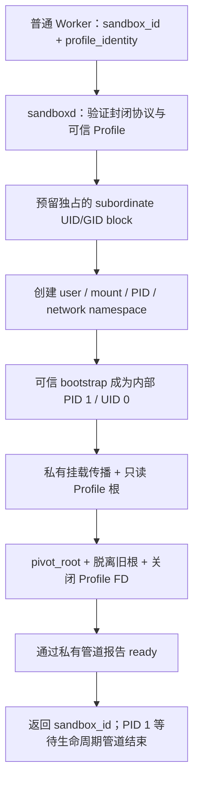

# T04：从一条创建请求到真实 Linux Sandbox

这次交付让 `create_sandbox` 第一次能够返回有内核隔离支撑的成功结果。`sandboxd` 会创建一个活着的可信进程，把它放入独立 namespace，并让它的 `/` 指向只读 Runtime Profile。客户端只拿到 `sandbox_id`。

当前是完整系统规格中的一个阶段。这个进程只等待退出，不接受 Workload；T05 的 Sandbox Init 和执行协议、T06 的完整故障清理，以及 T07–T12 对应的后续隔离与资源约束仍需完成。测试通过不等于现在可以安全运行任意 AI 生成代码。

## 先看一次创建经过什么



关键顺序是先确认隔离完成，再报告成功。创建子进程本身不代表挂载成功；bootstrap 若在切根过程中失败或没有及时报告 ready，Supervisor 返回 `creation_failed`，并回收这次创建占用的资源。

公开协议仍然只有 `create_sandbox`。客户端不能传 `/home/...` 这样的宿主路径，不能指定 UID、挂载参数或一段 shell。可信 Supervisor 自己根据 Runtime Profile 的摘要定位目录。这保留了 T03 的权限边界，也使新增能力容易审计。

## User Namespace：内部 root 对应谁

测试中的一个映射是：

```text
uid_map: 0 200000 65536
gid_map: 0 300000 65536

内部 UID 0       → 宿主 UID 200000
内部 UID 1000    → 宿主 UID 201000
内部 UID 65535   → 宿主 UID 265535
```

三个数字分别是内部起点、外部起点、数量。User Namespace 让内部 UID 0 能完成该 namespace 管辖的初始化操作，同时不把它映射成宿主 UID 0；它不会创建一个新的 Linux 内核。权限的作用范围与身份映射需要一起理解。参见 [user_namespaces(7)](https://man7.org/linux/man-pages/man7/user_namespaces.7.html)。

实现给每个活跃 Sandbox 分配独占的 65,536 个 UID 和 GID。好处是多个 Sandbox 的内部 UID 1000 不会落到同一个宿主身份；代价是需要管理足够大的预留范围，数量耗尽时必须拒绝创建。固定让所有 Sandbox 共用一段范围更省配置，但会让宿主文件权限难以区分它们。

这也不等于整个系统已经 rootless：本项目由宿主 root 运行 `sandboxd` 完成特权操作，Worker 才是普通进程。三个启动参数 `--subuid-start`、`--subgid-start`、`--subid-count` 声明 Platform Operator 已预留的范围；程序不读取或修改 `/etc/subuid` 和 `/etc/subgid`。预留必须避开系统账户、其他 Supervisor 和其他容器工具的分配。测试里的数字仅用于可丢弃环境，不能直接当成部署建议。

## 为什么不是只做 chroot

| 方法 | 解决的问题 | 单独使用的局限 |
| --- | --- | --- |
| `chroot` | 改变路径解析使用的根目录 | 不关闭已有 FD，也不自动改变当前目录；不建立身份、进程或网络隔离 |
| Mount Namespace | 提供独立的挂载视图 | 刚创建时仍带着旧挂载树，需要显式处理传播和旧根 |
| `pivot_root` + 卸载旧根 | 把新挂载切为根，并脱离旧挂载树 | 不处理身份、系统调用许可、资源消耗，也不自动关闭旧文件句柄 |
| User / PID / Network Namespace | 分别隔离身份、进程编号和网络视图 | 仍共享内核，且每类 namespace 只负责自己的那一部分 |

`chroot` 很适合构建环境或路径布局实验；其手册明确说明它不是一个完整的安全沙箱机制。这里需要同时整理挂载树和身份，所以组合多个原语。参见 [chroot(2)](https://man7.org/linux/man-pages/man2/chroot.2.html)。

切根前，bootstrap 先把挂载传播设为递归 private，避免自己的挂载操作影响宿主或接收宿主后续传播。它在独立 namespace 的临时 tmpfs 中创建挂载点，再用非递归 bind 引入 Profile，避免顺带带入 Profile 下的其他宿主挂载。根挂载最终为只读，附带 `nosuid`、`nodev`，并保留适用的原有挂载限制。

常见 `pivot_root(new_root, put_old)` 用法需要在新根中准备旧根目录。这里 Profile 已经不可变，使用手册记录的 `pivot_root(".", ".")` 写法：把旧根暂时叠在当前位置，再 `umount2(".", MNT_DETACH)` 脱离，最后 `chdir("/")`。这样不用为了初始化去修改 Profile。`MNT_DETACH` 移除挂载关联，不会消灭外部仍持有的引用，所以关闭旧 FD 仍是独立步骤。参见 [pivot_root(2)](https://man7.org/linux/man-pages/man2/pivot_root.2.html)。

## 三个容易被忽略的实现细节

第一个是如何进入受保护目录。Profile store 的宿主祖先目录可能是 `0700`；内部 root 映射成 subordinate UID 后，重新按宿主绝对路径找它会因权限不足失败。随手给目录放宽权限会改变安装边界。

实现先在 Supervisor 中逐级打开 `sha256/<digest>/rootfs`，拒绝符号链接并核对 root 所有权和安装模式。然后锁住一个 OS 线程，通过 `unshare(CLONE_FS)` 分离它的当前目录状态，用已打开的 FD 进入 Profile，再启动子进程。创建 Mount Namespace 时，继承的当前目录会进入新挂载视图；已打开 FD 则仍引用原来的挂载，因此 bootstrap 用继承的当前目录作为 bind 来源，用 FD 核对身份后关闭它。该线程退出后由 Go 回收，不让修改过的当前目录泄漏给服务的其他工作线程。参见 [unshare(2)](https://man7.org/linux/man-pages/man2/unshare.2.html) 和 [Go 的 LockOSThread](https://pkg.go.dev/runtime#LockOSThread)。

第二个是运行时自己的文件句柄。应用代码没主动打开宿主文件，不代表运行时也没有。Go 的容器感知并行度逻辑可能保留宿主 cgroup 文件。本次为可信 bootstrap 设置 `GOMAXPROCS=1`、`GODEBUG=containermaxprocs=0,updatemaxprocs=0`，避免这些探测与更新留下宿主 FD；测试再从 `/proc/<pid>/fd` 检查实际结果。这只限制可信 bootstrap 的 Go 并行度，不是 Workload CPU 配额。环境参数说明见 [Go runtime 文档](https://pkg.go.dev/runtime)。

第三个来自代码审查：如果启动 shell 用 `9</某个宿主目录` 把 FD 9 传给 `sandboxd`，Go 的 `ExtraFiles` 不会自动阻止它继续传给子进程。回归测试实际复现了这个泄漏。现在 Supervisor 启动时将非标准继承 FD 标记为 `CLOEXEC`，让下一次 `exec` 关闭它们，再显式传递需要的私有句柄。这样不会像粗暴关闭所有 FD 那样破坏 Go 的内部事件机制。子进程的诊断输出也经过管道转发，避免拿到 Supervisor 的宿主日志文件句柄。

## 五分钟实验：先复现证据

前提是已准备专用、可丢弃的 Linux 环境、符合 `go.mod` 的 Go、`sudo` 和 util-linux（提供 `unshare`、`nsenter`）。在该环境的仓库根目录，以普通用户运行；首次下载 Go 工具链或依赖可能超过五分钟。

```sh
# 普通用户验收真实 Unix socket 协议。
go test ./tests -run '^TestSandboxSupervisor' -count=1

# 构建工具后，在隔离的 mount/PID/network 测试环境中运行创建验收。
bash tests/run-sandbox-creation-linux.sh
```

第二条脚本会在需要时调用 `sudo`，也可以由已有 root 账户运行；第一条协议测试必须是普通用户。脚本构建 `sandboxd`、`profile-bundle`、`sandbox-root-probe` 和带 `sandbox_root,profilebundle_root` 标签的测试程序，并通过绝对路径变量 `SANDBOXD_CLI`、`PROFILE_BUNDLE_CLI`、`SANDBOX_ROOT_PROBE` 交给测试。临时 Profile 与 Sandbox 都属于测试夹具。

若已为目标 Linux 环境交叉编译，可以设置 `SANDBOX_TEST_BIN_DIR` 为该环境中四个同名二进制所在的绝对目录，再运行脚本。例如 `/opt/t04-test-bin` 必须先实际包含上述四个文件；不要把 Windows 盘符路径直接传进 Linux。日常实验无需设置此变量。

读测试时重点寻找以下证据：

- `/proc/<pid>/uid_map` 和 `gid_map` 精确匹配配置；没有继承宿主附加组。
- user、mount、PID、network namespace 与测试宿主不同。
- Sandbox 的 mountinfo 中只剩私有只读根；没有旧根挂载。
- ready 之后没有指向宿主目录或普通文件的 FD。
- 可信探针读取宿主专属标记得到 `ENOENT`，尝试写根目录得到 `EROFS`；宿主标记和宿主挂载的可写状态保持正常。

探针成功时内部输出 `host-root-unreachable; profile-read-only`，测试会核对它。探针是 Go 测试程序，刻意安装到夹具的 `/opt/python/bin/python3`；不是 CPython。它由拥有权限的测试端用 `nsenter` 进入 Sandbox 启动，`sandboxd` 没有为测试增加执行后门。

这些测试说明上述内核行为在实际测试环境成立。它们没有证明能执行 Python、能抵抗任意内核漏洞、能限制 fork/内存/CPU，或能在任意崩溃后回收完整 Workload。当前只保证创建阶段与空闲可信进程的基础收尾；后续功能仍按原有票据与 ADR 实现。

## 建议自己讲一遍

不看代码，尝试回答：“内部 UID 0 为什么不是宿主 root？为什么只读根仍然要关闭 FD？为什么报告 ready 要等到 `pivot_root` 之后？为什么测试能用 `nsenter`，产品却没有执行接口？”

能解释这些问题后，再读 [`creation_linux.go`](../../internal/sandboxsupervisor/creation_linux.go) 的创建流程、[`bootstrap_linux.go`](../../internal/sandboxsupervisor/bootstrap_linux.go) 的根切换，以及 [`sandbox_creation_linux_test.go`](../../tests/sandbox_creation_linux_test.go) 的外部验收。你会看到每个操作都对应一个可观察的边界，而后续 T05 会在这个已经建立的环境中实现真正的 Execution。
