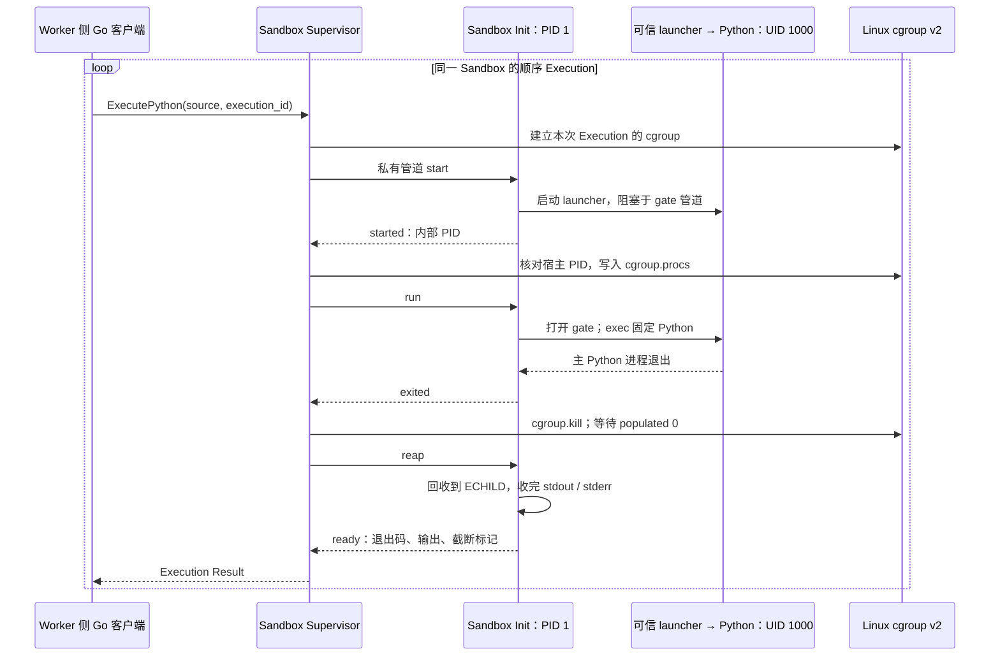

# T05：让同一个 Sandbox 连续执行 Python

T05 把 T04 创建出的隔离环境接上了真正的执行流程：可信 Sandbox Init 常驻为内部 PID 1；每次 Python Workload 使用内部 UID/GID 1000；一次 Execution 结束并清理进程后，下一次可以继续使用同一个 Workspace。第一次写入的 `answer.txt`，第二次可以读取。

这解决的是“如何可靠地接续两次执行”这一阶段问题。完整生命周期与重启恢复属于 T06；T07–T12 的后续隔离、资源与结果合同仍需继续完成。当前版本还不能据此宣称已经加固为可运行任意不可信代码的生产沙箱。

## 先分清三个角色

| 角色 | 在哪里、用什么身份运行 | 本次职责 |
| --- | --- | --- |
| Sandbox Supervisor | 宿主机上的特权 `sandboxd` | 验证请求、创建隔离环境、操作宿主 cgroup、决定何时允许下一次 Execution |
| Sandbox Init | Sandbox 内部 PID 1、UID/GID 0 | 接收私有控制消息、创建普通身份子进程、回收退出状态、报告结果 |
| Workload | Sandbox 内部普通进程、UID/GID 1000 | 运行固定 Runtime Profile 中的 Python，读写本次 Agent Run 的 Workspace |

这里的“内部 UID 0”沿用 T04 的 User Namespace 映射，不等于宿主 UID 0。当前仍由宿主特权 Supervisor 完成创建；因此也不能把整个实现称为 rootless。

一次 Agent Run 可以有多个顺序 Execution。Sandbox 与 Workspace 的寿命比单次 Execution 长，Python 进程的寿命则较短。复用的是文件状态和隔离环境，**不会保留上一次 Python 进程中的变量、导入对象或内存**。

## 一次执行实际经过什么

创建时，Supervisor 先验证 Profile 中的 Init。bootstrap 沿用 T04 的 namespace、只读根和 `pivot_root` 流程，挂载私有 `/proc`、Workspace 与 `/tmp`，最后用 `exec` 把自己替换成 `/sandbox-init`。Init 完成入口检查后才报告就绪。

下面省略了创建过程，展示两次 Execution 共用一个 Init 的顺序。`start`、`run`、`reap` 是内部管道协议；外部客户端调用的是 `ExecutePython`。



代码入口是 [execution_linux.go](../../internal/sandboxsupervisor/execution_linux.go)、[init_linux.go](../../internal/sandboxsupervisor/init_linux.go) 和 [cgroup_linux.go](../../internal/sandboxsupervisor/cgroup_linux.go)。阅读时沿着 `start → started → run → exited → reap → ready` 找对应调用，比先看所有辅助函数容易理解。

## 为什么让可信 Init 常驻 PID 1

PID Namespace 中的 PID 1 会接收本 namespace 内被遗弃的子进程；它退出时，内核会终止该 namespace 的其余进程。这个角色直接关系到进程回收和 Sandbox 生命周期。参见 [pid_namespaces(7)](https://man7.org/linux/man-pages/man7/pid_namespaces.7.html)。

如果直接把第一段 Python 当作 PID 1，Python 一结束，这个 Sandbox 就结束了，第二次执行无法继续；同时还把回收后代进程的责任交给了不可信 Workload。现在由可信 Init 持续管理子进程，Python 正常退出、抛异常或被信号终止，都不必天然等同于 Sandbox 结束。

bootstrap 和 Init 也有各自的阶段职责。bootstrap 负责建立隔离边界，Init 负责长期处理执行。两者之间使用 `exec` 替换程序，不额外再生一个长期守护进程，因此 Init 继续占有原来的 PID 1。对应实现见 [bootstrap_linux.go](../../internal/sandboxsupervisor/bootstrap_linux.go)。

把所有逻辑一直放在 bootstrap 中，也可以做出功能，但会把切根初始化与长期运行状态机绑得更紧；本次单独编译 Init，还能让它作为 Profile Bundle 中独立的受验证组件交付。代价是多一个程序入口、一道交接协议，以及必须始终匹配的构建和安装流程。

## 为什么 Init 用继承的管道通信

本次存在两条不同边界：Worker 通过有权限限制的宿主 Unix socket 访问 Supervisor；Supervisor 通过创建子进程时传入的匿名管道控制 Init。Init 自己不监听 TCP 端口，也不在 Sandbox 内发布 Unix socket 地址。

匿名管道没有可让 Workload 自行连接的路径。持有正确文件描述符的一方才能使用它；Python 最终只获得标准输入、标准输出和标准错误。启动它之前短暂存在的 gate FD，也会在执行 Python 前关闭。

这必须配合 `CLOEXEC`，而不能只依赖“我没有主动传它”。普通文件描述符默认可以跨 `exec` 保留，标记 `FD_CLOEXEC` 后才会在 `exec` 时关闭。Init 给控制管道加上该标记，再显式安排 launcher 的 stdio 和 gate；实现还继承了 T04 对 Supervisor 外来 FD 的处理。参见 [execve(2)](https://man7.org/linux/man-pages/man2/execve.2.html)。Go 的 `os.ProcAttr.Files` 用来明确安排新进程的文件描述符位置，前三个位置对应标准输入输出，见 [Go os.ProcAttr 文档](https://pkg.go.dev/os#ProcAttr)。

公开监听 socket 更便于独立启动、重连或人工调试，但还需要设计地址可见性、连接鉴权、重复连接、会话绑定和请求伪造防护。当前 Init 与 Supervisor 一起创建、寿命紧密相连，继承管道使这条内部边界更小。它的代价是连接丢失后不能随意重连到原 Init；完整恢复策略要在生命周期工作中定义。

## 为什么 Workload 固定为 UID 1000

namespace root 仍然比同一 namespace 内的普通身份拥有更大权限。可信 Init 需要执行管理操作；Python 只需要运行代码、使用 stdio、写自己的输出目录。把两者分别设为内部 UID 0 和 UID 1000，让文件权限能区分控制进程与 Workload。

实现启动 launcher 时固定 `Uid: 1000`、`Gid: 1000`，清空补充组；工作目录固定为 `/workspace/output`，环境变量由可信代码提供。Python 路径固定为 `/opt/python/bin/python3`，使用 `-I -B -c` 执行源码，客户端不提供任意可执行路径、shell、身份或宿主环境。

如果 Python 也用 namespace root，确实可以减少一部分权限配置，但 Workload 会获得当前阶段并不需要的权限，Init 与 Workload 之间也少了一层身份区分。普通 UID 是缩小权限的组成部分，**不能替代后续 capability、`no_new_privs` 和 System Call Policy 的约束**。当前 syscall allowlist 仍未开始执行。

## 为什么先阻塞 launcher，再放进 cgroup

一个常见写法是“先启动 Python，再把它的 PID 写入 `cgroup.procs`”。这存在时间窗口：Python 可能在迁移前已经 `fork`，迁移父进程并不会自动把先前出生的子进程全部迁移过去。Linux 文档规定，新子进程继承创建它时父进程所在的 cgroup。参见 [cgroup v2 的进程组织规则](https://docs.kernel.org/admin-guide/cgroup-v2.html#processes)。

本次先启动一个可信、普通身份的 launcher，让它阻塞在一根单独的 gate 管道。Init 报告内部 PID，Supervisor 在宿主 `/proc` 中核对它确实是该 Init 的直接子进程，再写入本次 Execution 的 cgroup。只有写入成功，Supervisor 才发送 `run`，由 Init 放开 gate；此后 launcher 才 `exec` Python。

这样，不可信 Python 代码的第一条指令执行前，进程归属已经确定。gate 之前运行的是可信启动代码，所以这也不是“任何 CPU 和内存开销从进程诞生起都已经完整计费”的承诺。相比启动后再迁移，多了进程入口与握手阶段；得到的是清晰的先后关系，避免依靠调度器“应该来得及”。

## 为什么主进程退出后，还要 kill 和 reap

考虑这段行为：主 Python 进程创建子进程，子进程再创建孙进程并脱离原会话；主进程立刻返回。此时只 `Wait` 主进程，拿到的只是它的退出状态，剩下的进程仍可能写 Workspace，甚至持有 stdout 的写端，让输出读取一直等不到 EOF。

本次每个 Execution 使用独立 cgroup，Init 自己留在外面。主 Python 退出后，Supervisor 向 `cgroup.kill` 写 `1`，并等到 `cgroup.events` 中的 `populated` 为 `0`；Init 随后继续回收已退出的子进程，直到 `ECHILD`，再结束输出收集并报告 `ready`。内核分别提供整棵 cgroup 子树终止和“没有活进程”的状态；后者并不等同于僵尸进程已经被父进程回收。参见 [cgroup v2 接口文档](https://docs.kernel.org/admin-guide/cgroup-v2.html#core-interface-files)。

| 做法 | 适合什么情况 | 本项目需要补足的地方 |
| --- | --- | --- |
| 只等待主进程 | 确定不会产生后代的简单程序 | 无法确认后台后代已经结束，也可能卡在被后代持有的输出管道上 |
| 向进程组发信号 | 协作型命令、常规 shell 管道 | 后代可以改变进程组或建立新会话；进程组不能充当这里的完整成员边界 |
| 每次销毁整个 Sandbox | 无需复用状态的单次执行 | 会连同 Init 和 Workspace 一起结束，无法直接承接下次 Execution |
| 本次的独立 Execution cgroup + Init 回收 | 同一 Sandbox 中顺序运行的 Workload | 需要 cgroup v2、清理握手和失败处理；后续还要补资源预算与完整恢复 |

Init 只安排一个 `Wait4(-1, ...)` 回收者，同时处理主进程与被收养的后代，避免一个 `Process.Wait` 和另一个全局 waiter 互相取走对方所需的退出状态。Supervisor 在本次清理无法确认成功或握手失效时，会终止该 Sandbox，阻止它带着不确定状态进入下一次 Execution。对应逻辑仍见 [Init 的等待与输出处理](../../internal/sandboxsupervisor/init_linux.go)。

## 为什么共享 Workspace，且仍保留只读根

两次 Execution 使用同一 Sandbox 内的 `/workspace/output`。第一次写文件后，它不会随着 Python 退出而消失；第二次 Python 从相同目录启动，就能读取文件。当前 Workspace 是该 Sandbox 私有的 tmpfs，**这是存活期间的状态延续，不是跨 Supervisor 重启的持久化存储**。

只读 Profile 根保存可信运行时和 Init，独立可写挂载提供 Workspace 与临时目录。这样不需要为了写一个 `answer.txt` 而开放整个运行时根目录。每次重新创建 Sandbox 的方案生命周期更简单，也容易清空所有瞬时状态；但要继续上一步计算，就必须额外搬运文件，并支付重复初始化的成本。

复用同样有代价：每次必须清理进程，后续还要按整个 Agent Run 累计资源使用，且绝不能把同一 Workspace 交给不同 Agent Run。当前建立的是输出目录与临时挂载，完整不可变输入、配额及 Artifact 提取合同要由后续 ticket 补齐。

## 为什么 Init 的摘要与 rootfs 摘要分开

Profile Bundle 已有独立 `sandbox-init` 组件和 `rootfs.tar` 组件。本次继续使用这个合同：构建器记录实际静态 Go Init 的大小和 SHA-256；安装器先验证 Bundle 和组件，再将 Init 复制到安装根的 `/sandbox-init`，并建立空 `/proc`、`/workspace`、`/tmp` 挂载点，最后以只读模式原子发布。

这四个位置由安装布局保留，运行时归档不能通过文件、后代路径或符号链接占用它们。Supervisor 创建前又通过可信目录句柄打开 Init，验证所有者、模式、大小与 manifest 摘要。原始 `rootfs.tar` 的摘要仍只描述锁定的运行时输入；修改 Init 会改变 Init 组件及完整 Bundle 的身份，不必同时改变 Python 根组件的身份。

直接把 Init 再塞入 `rootfs.tar` 也能验证，但每次 Init 修复都要重算该运行时组件的身份；完全在 Bundle 外部署 Init 则需要另建一套版本配对与信任机制。本次选择增加一个受约束的安装步骤，并用相同 Bundle 的完整安装树比较验证重复安装。摘要提供内容绑定，可信配置中的预期 Bundle 摘要才是信任来源；把文件和旁边的摘要一起任意替换，不能产生可信度。

相关实现见 [安装器](../../internal/profilebundle/install_linux.go)、[创建前 Init 检查](../../internal/sandboxsupervisor/profile_init_linux.go)；完整格式合同见 [Profile Bundle v1](../profile-bundle-v1.md)。

## 亲手跑一次，并看懂证据

先在专用、可丢弃的 Linux 环境准备符合 `go.mod` 的 Go、util-linux、`sudo`、可写 cgroup v2，以及按 [Profile Bundle 合同](../profile-bundle-v1.md) 校验过的锁定源码缓存。仓库已经提供实际可运行的验收入口：

```sh
PROFILE_BUNDLE_SOURCE_CACHE=/absolute/path/to/verified-source-cache \
  bash tests/run-sandbox-init-linux.sh
```

这会构建 Supervisor、实际 Init 和实际 Python Profile Bundle，再进入隔离的 Linux 测试环境。不要把用于 T04 根隔离探测的 `sandbox-root-probe` 当成 Python；这个 T05 入口使用锁定的 CPython。

如果希望观察应用侧如何调用，下面是一个完整的 Go 客户端示例。先按 [Supervisor 配置合同](../sandbox-supervisor-protocol-v1.md) 启动 Supervisor、启用已预留的 subordinate IDs 和 `--cgroup-root`，安装真实 Bundle，并让调用账户属于授权 Worker 组。将示例放到本仓库内的 `.cache/t05-demo/main.go`，在 Linux 上用 `go run ./.cache/t05-demo` 执行。它使用仓库现有 Go client，不存在另一个假定的 `sandbox execute` CLI。

```go
package main

import (
    "context"
    "fmt"
    "log"
    "os"
    "time"

    "github.com/TH1NKING/Build-your-own-Docker-with-Go/internal/sandboxsupervisor"
)

func main() {
    socket := os.Getenv("SANDBOX_SUPERVISOR_SOCKET")
    identity := os.Getenv("SANDBOX_PROFILE_IDENTITY") // sha256:<已安装 Bundle 的摘要>
    if socket == "" || identity == "" {
        log.Fatal("请设置 SANDBOX_SUPERVISOR_SOCKET 和 SANDBOX_PROFILE_IDENTITY")
    }
    client := sandboxsupervisor.NewClient(socket)
    ctx, cancel := context.WithTimeout(context.Background(), 30*time.Second)
    defer cancel()
    sandboxID := fmt.Sprintf("lesson-%d", time.Now().UnixNano())
    created, err := client.CreateSandbox(ctx, sandboxsupervisor.CreateSandboxRequest{
        RequestID: "create-lesson", SandboxID: sandboxID, ProfileIdentity: identity,
    })
    if err != nil {
        log.Fatal(err)
    }
    if created.Error != nil {
        log.Fatal(created.Error.Code)
    }
    if created.Result == nil {
        log.Fatal("缺少创建结果")
    }
    sources := []string{
        "import os\nassert os.getuid() == 1000 and os.getppid() == 1\nopen('answer.txt', 'w').write('42')\nprint('first-ok')",
        "import os\nassert os.getuid() == 1000 and os.getppid() == 1\nprint(open('answer.txt').read())",
    }
    for index, source := range sources {
        executionID := fmt.Sprintf("execution-%d", index+1)
        response, err := client.ExecutePython(ctx, sandboxsupervisor.ExecutePythonRequest{
            RequestID: executionID, SandboxID: sandboxID, ExecutionID: executionID,
            Source: source, Stdin: "",
        })
        if err != nil {
            log.Fatal(err)
        }
        if response.Error != nil {
            log.Fatal(response.Error.Code)
        }
        if response.Result == nil {
            log.Fatal("缺少 Execution Result")
        }
        result := response.Result
        fmt.Printf("%s: exit=%d stdout=%q stderr=%q truncated=%v\n",
            result.ExecutionID, result.ExitCode, result.Stdout, result.Stderr, result.Truncated)
    }
}
```

期望输出的核心是第一次 `stdout="first-ok\n"`、第二次 `stdout="42\n"`，两次退出码均为 `0`。示例中的客户端 30 秒 context 只是等待上限，不是服务端取消 Execution 的合同。运行示例会留下一个存活的 Sandbox；当前尚无完整的公开销毁流程，应在本次专用实验结束时停止对应 Supervisor，完整生命周期留给 T06。

回归证据集中在 [Sandbox Execution 验收测试](../../tests/sandbox_execution_linux_test.go)：除了前后两次 Python 与文件状态，还覆盖脱离会话的后代清理、只读 Profile 与描述符边界、异常退出与输出截断后再次执行。另有 [Profile 安装测试](../../tests/profile_bundle_install_linux_test.go) 和 [真实 Profile 生产输入测试](../../tests/profile_bundle_production_linux_test.go)，分别验证安装边界与实际 Init 的组件身份、锁定运行时内容。测试只能支持它明确检查的性质，不能替代尚未实施的后续安全合同。

## 当前限制，以及秋招时怎样讲

当前每路 stdout/stderr 最多保留 **4 KiB**，超出后继续读取丢弃，最终设置 `truncated`。这样限制的是返回结果的保留内存，不能据此声称已经限制 Workload 的累计输出、CPU、IO 或总运行成本。Supervisor 的 **60 秒内部传输保护**与有限清理等待，也不是后续可配置 deadline、取消语义及完整 Execution Result 的实现。T11 尚未因此完成。

T06 还需补完整失败清理、生命周期和重启恢复；T07–T12 还需完成规格要求的安全强化、资源控制与结果等合同。当前 cgroup 用于进程归属和终止，不能等同于已经实现 CPU、内存、进程数等 Resource Budget；固定的 Workspace/tmpfs 参数也不能代替完整存储配额方案。

面试时可以先讲清一个可演示的结果，再挑两个设计难点深入：

> 我给自研 Linux Sandbox 增加了常驻 PID 1 的可信 Init。多个顺序 Python Execution 用普通 UID 运行，并共享同一个 Workspace。我用继承管道隔开内部控制通道，先阻塞 launcher、完成 cgroup 归属后再运行 Python；主进程退出后，清理该 Execution 的后代并统一回收，再接收下一次执行。真实 Linux 测试验证了连续写读、后台后代清理和权限边界。完整资源预算与恢复仍在后续迭代。

讲这个项目时，最值得自己推演的三个问题是：如果去掉 gate 会在哪个时刻出现竞态；如果只等待主进程会漏掉什么；如果 `ready` 提前于清理完成返回，第二次 Execution 会受到什么影响。能够用代码、时序和一次实际演示回答这些问题，比只列出 namespace、cgroup 和 Go 几个名词更能说明你理解了实现。

## 本次实际验证与审查

2026-09-05 在 Linux 5.15.153.1（WSL2）上完成真实内核验收，原生 Go 版本为 1.26.1。普通身份下的全仓格式、静态分析、测试、构建与 Shell 语法检查通过；原有 Sandbox 创建验收通过；真实 CPython 的七项 T05 验收通过，覆盖连续状态、并发拒绝、脱离会话的后代清理、描述符和只读根、失败与输出、Init 丢失、非法源码。Bundle 安装合同和两项真实 Python 生产输入测试也已通过。

审查中的一个具体教训是：源码字符串里的 NUL 字节不能直接放进进程启动参数。原实现会让 `StartProcess` 失败并退出 Init，连带销毁 Workspace。回归测试先复现了这个错误；修复后，Supervisor 在分发前返回 `malformed_request`，下一次合法执行仍能读取已有文件。这说明要区分“不合法的 Workload 输入”和“可信控制进程失效”。

另一项修复是在空的 Execution cgroup 上预先确认 `cgroup.kill` 与状态读取可用。仅识别出 cgroup v2 挂载，还不足以确认当前内核提供了整个执行流程需要的接口。提前检查能让不支持的部署在运行 Python 前失败。
2026-09-06 的 GitHub Linux 6.17 验收还发现了挂载顺序问题：先脱离旧根、再挂载 proc，会让内核在检查 user namespace 可见的 proc 实例时返回 `EPERM`。修复为：在旧根仍可见时，将当前 Sandbox PID namespace 的全新 proc 挂到新根的 `/proc`，随后切根并脱离旧根。这里没有把宿主 proc 绑定进 Sandbox；测试另外检查 `/proc/self` 和 `/proc/1/comm`，确认看到的是 Sandbox 的进程身份。这也是保留不同 Linux 环境验收的价值。规则依据见 [Linux proc 挂载限制](https://www.kernel.org/doc/html/latest/filesystems/proc.html#mount-restrictions)。