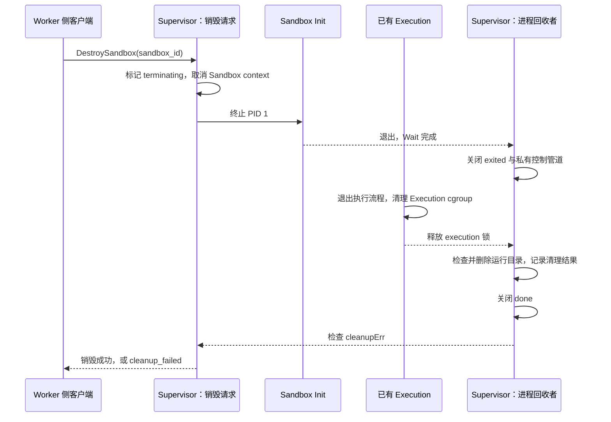

# T06：让 Sandbox 的结束同样可靠

T05 让一个 Sandbox 能连续执行多段 Python，并在 Execution 之间保留 Workspace。T06 补上另一个方向：当 Agent Run 结束、创建失败、Init 意外退出，或者客户端在请求尚未完成时断开，Supervisor 应该结束谁、等待什么、清理什么，以及什么时候可以告诉调用方“已经销毁”。

本次最直观的新增能力是 Go 客户端的 `DestroySandbox`。更值得理解的变化藏在它背后：每个 Sandbox 有独立的取消信号；请求只有取得资源后才获得取消它的权利；进程退出与清理结束分别通知；已经终止的 Sandbox 标识在本次 Supervisor 运行期间不能再次指向另一个 Sandbox。

这里遵循 [一 Agent Run 一 Sandbox](../adr/0003-one-sandbox-per-agent-run.md)、[可信 Init 常驻 PID 1](../adr/0016-keep-one-sandbox-init-per-agent-run.md) 和 [特权操作集中在 Supervisor](../adr/0015-isolate-privileged-sandbox-operations.md) 的决策。一次 Python 结束可以继续执行；Sandbox 结束后，旧 Workspace 和旧标识不能继续服务下一次 Execution。

## 先区分三种“结束”

| 事件 | 意味着什么 | 是否允许下一次 Execution |
| --- | --- | --- |
| 一次 Execution 正常结束 | 主 Python 退出，既有 cgroup 清理与 Init 回收协议完成 | 允许，继续共享该 Sandbox 的 Workspace |
| Init 已退出并被 Supervisor 回收 | Sandbox 的 PID 1 消失，原执行环境不能继续使用 | 不允许，但宿主侧清理可能还在进行 |
| Sandbox 清理流程结束 | 当前 Execution 已释放使用权，运行目录清理已经完成或记录失败 | 不允许；销毁成功还需要确认没有清理错误 |

进程退出并不等于全部清理成功。代码因此分别使用 `exited` 和 `done` 两个通知通道；`done` 关闭后仍然要检查 `cleanupErr`。后者记录运行目录清理失败，公开销毁操作返回 `cleanup_failed`，而不会把“已经尝试过”说成“已经成功”。

主要入口是 [lifecycle_linux.go](../../internal/sandboxsupervisor/lifecycle_linux.go)。阅读时先看 `destroy`、`controlOperation`，再看 [creation_linux.go](../../internal/sandboxsupervisor/creation_linux.go) 中的 `reserve`、`create` 和 `releaseLocked`，最后对照 [execution_linux.go](../../internal/sandboxsupervisor/execution_linux.go) 的执行锁与失败退出路径。

## 显式销毁的承诺是什么

调用 `DestroySandbox` 后，Supervisor 先在锁内把 Sandbox 标记为正在终止，随后取消它的 context，再等待 `done`。在这段时间里，新 Execution 会被拒绝；已有 Execution 则通过 Init 终止、管道关闭和既有失败清理路径退出。运行目录清理成功后，Supervisor 才返回销毁结果。

销毁操作是幂等的：销毁一个已经不存在的 Sandbox，也返回成功。这样，当调用方遇到网络错误，不确定前一次销毁是否已经生效时，可以继续对相同标识请求销毁。幂等描述的是重复调用的最终效果，不代表每次调用都会执行一遍相同的系统调用，也不代表所有失败都会被吞掉。

清理失败时，Supervisor 保留对应的活动记录和 subordinate ID 预留，后续销毁可以重试运行目录清理。这样做会暂时占住容量，但避免在旧资源状态尚未明确时复用身份。若目录被替换或包含意外文件，重试也不会自动把那些内容递归删除；需要先由可信 Platform Operator 排查并处理异常。



图中省略了没有活动 Execution 的情况：此时回收者可以立即取得执行锁，进入目录清理。已有 cgroup 清理逻辑继续承担每次 Execution 的后代终止；T06 没有把 CPU、内存、swap 或 PID Resource Budget 加进来，也没有新增 cgroup 清理失败的持久重试机制。

## 为什么必须有 exited 和 done 两个通知

最容易写出的版本是“只有一个 `done`，所有地方都等它”。问题在于不同等待者需要的事实不一样。

假设 Execution 持有 `execution` 锁，执行握手失败，于是在退出路径中终止 Init 并等待清理完成。与此同时，负责回收 Init 的 goroutine 想先拿到 `execution` 锁、完成目录清理，再关闭唯一的 `done`。这就形成了环：Execution 等回收者，回收者又等 Execution 释放锁，两边永远不能前进。

本次把顺序拆开：Init 的 `Wait` 返回后先关闭 `exited`；Execution 只等待这个事实，就可以完成自身清理并释放锁；回收者随后拿锁，清理运行目录，再关闭 `done`。外部的销毁请求等待 `done`，因为它需要更完整的结束条件。

这不是“多加一个 channel 就解决并发”的技巧，而是把两个不同的状态写清楚。判断一个等待设计是否可靠，可以画出依赖箭头：谁持有什么锁、等哪个事件、谁负责产生这个事件。如果箭头形成环，就要重新划分阶段或缩小锁的范围。

## 为什么取消信号属于每个 Sandbox

Supervisor 的 context 是最外层生命期；每个 Sandbox 从它派生自己的 context。创建 bootstrap 使用 `exec.CommandContext(sandbox.ctx, ...)`，因此同一个取消信号既覆盖尚在创建中的进程，也覆盖创建成功后常驻的 Init。显式销毁、请求丢失和 Supervisor 关闭可以汇聚到这条终止路径。

如果只有 Supervisor 的全局取消信号，取消一个 Sandbox 就可能误伤其他 Agent Run。如果每条失败分支各自写一套 kill、关管道、删目录，又容易遗漏某个阶段，或者让两条并发路径重复释放同一资源。独立 context 表达“这个 Sandbox 不再继续存活”，统一的回收路径负责落实清理，职责比较明确。

context 本身并不会替你删除文件或证明资源已经释放。它只是发出停止意图，所以销毁仍必须等待完成事件、检查清理结果。这里也没有把“取消一次 Execution 后仍保留 Sandbox”定义成新的公开合同：当前请求中途丢失会终止其已经取得的整个 Sandbox；更细的 Execution deadline 和取消结果属于后续工作。

## socket 关闭为什么不能直接等同于销毁

现有公开 Go 客户端每个请求建立一条 Unix socket 连接，收到响应后正常关闭。第一次 `CreateSandbox` 成功后，客户端还要用新连接执行 Python；一次 Execution 成功后，又要用新连接发起下一次。

因此，“看见 EOF 就销毁”会把正常请求的结束误判为 Agent Run 放弃 Sandbox。反过来，完全不观察连接丢失，又会让一个中途取消、再也等不到结果的创建或执行继续占用资源。

本次为每个请求建立 `controlOperation`。读完请求帧后，一个 watcher 继续观察连接；EOF、读取错误或额外请求字节意味着尚未完成的这次请求被放弃。只有成功预留 Sandbox 的创建请求，或成功取得执行锁的 Execution 请求，才调用 `own`，把请求取消与该 Sandbox 关联起来。

这条所有权规则很关键。例如，有一个 Execution 正在运行，第二个请求得到 `sandbox_busy` 后断开；第二个请求没有获得执行权，也就没有权利取消第一个请求的 Sandbox。重复创建被拒绝时，同样不能顺手清理另一个请求已经创建的资源。

还有一个很窄但真实的竞态：服务端刚写出成功响应，客户端立即读取并关闭，watcher 可能同时得到 EOF。本次让“写出响应并标记请求结束”和“watcher 判定请求被放弃”使用同一个互斥锁。成功响应先完成时，之后的 EOF 不再触发取消；EOF 先成立时，仍按中途放弃处理。完成路径再解除请求与 Sandbox 的取消关联。

这个边界是服务端成功写出响应，不是应用层确认客户端已经持久保存结果。若将来需要断线后查询同一请求的确定结果，还需要请求幂等记录或恢复协议。也可以改成长连接拥有整个 Sandbox，但那会改变当前客户端和 Workspace 复用合同，并带来重连时所有权如何转移的问题。

## 清理为什么只删除自己创建的空目录

创建的顺序包括预留身份区间、创建运行目录、建立管道、启动 bootstrap、等待 Init 就绪。任何阶段都可能失败。本次把“尚未移交给长期回收者的资源”和“已经移交的资源”分开：创建失败由当前调用回滚；Init 成功就绪后，由等待 Init 退出的回收者接管生命期。

失败回滚不能等同于 `defer os.RemoveAll(path)`。Supervisor 有宿主特权，如果拼出来的路径意外指向已有目录、符号链接或被替换的目录，递归删除会扩大一次创建失败的影响。预先存在的同名目录也可能属于其他状态，不能因为 `Mkdir` 失败就把它清空。

这里通过受信任的 `os.Root` 解析运行目录，记录创建时的目录身份。清理前用 `Lstat` 确认仍然是目录，并以 `os.SameFile` 检查是否仍是原对象；最后用非递归 `Remove` 删除空目录。出现意外内容或对象替换，就报告错误、保留状态，不继续向下遍历。这套检查依赖仓库既定的可信宿主目录边界，并不声称能防住任意特权宿主进程同时修改文件系统。

注意，宿主运行目录不是存放 Python 输出文件的整个 Workspace。当前 Workspace 与 `/tmp` 是 Sandbox 私有 mount namespace 中的 tmpfs；Sandbox 进程与相关 namespace 引用结束后，这些私有挂载随之释放。Supervisor 清理的是自己在宿主维护的空运行目录，不能据此删除 operator-managed Profile Bundle。

对于确定由程序独占、没有特权边界的临时目录，递归删除仍然是合理工具。这里选择非递归删除，是因为实际正常布局本来就应当为空，而且异常时保留证据和避免扩大删除范围，比“尽量删干净”更重要。

## 为什么终止后的标识要留下墓碑

假设 Sandbox `A` 已终止，Supervisor 立即从 `active` 删除它并允许再创建另一个 `A`。一个延迟到达的旧 `ExecutePython(A)` 就可能落到新 Sandbox 上。调用方眼中的同一个名字，已经悄悄换成另一个隔离环境，这类问题通常称为 ABA 问题。

本次在运行中的 Sandbox 终止并清理成功后，把标识放入 `retired`。同一个 Supervisor 进程生命期内，再用该标识创建会得到 `sandbox_exists`；对旧标识执行会得到 `sandbox_not_found`；重复销毁仍然成功。身份区间可以在清理成功后供新的 Sandbox 标识使用，标识本身则保持失效。

创建未成功就绪、且已安全回滚的尝试可以重试原标识：它没有交付过可运行的 Sandbox。这和一个已经运行过、后来终止的 Sandbox 是两种状态。清理失败时，活动记录仍保留，也不会提前允许复用。

内存墓碑实现简单，代价是记录随本次 Supervisor 运行逐渐增加，而且重启后不保留。另一种设计是标识带 generation，或者用持久状态记录每次 Sandbox 的代际；这更适合跨重启恢复，但需要协议、存储和恢复时的一致性设计。当前 T06 不包含 Supervisor 重启后恢复存活 Sandbox、Workspace 持久化、孤儿资源扫描或跨重启墓碑。

## Supervisor 关闭时为什么还要管连接

只关闭 listener，只能停止接收新连接；已有连接仍可能卡在未读完的请求帧，或者等待一次运行中的 Execution。若随后直接等所有 handler 退出，关闭流程就可能被这些连接拖住。

本次将已有连接也与 Supervisor context 关联。服务结束时先取消，使连接关闭、读取等待被唤醒，并把取消传播到 Sandbox；然后等待 handler 与 Sandbox 回收者退出，最后关闭持有的受信任目录句柄。这个顺序让清理时需要的上下文仍然可用。

这支持正常取消与关闭时的收尾，不等于断电、内核崩溃或 Supervisor 被强制杀死之后的持久恢复。讲项目时应当把这两个层面的承诺分开。

## 亲手演示：连续执行，再销毁

先在 Linux 环境按 [Supervisor 协议与配置合同](../sandbox-supervisor-protocol-v1.md) 启动 `sandboxd`，安装真实 Python Profile Bundle，配置已预留的 subordinate IDs 与可写 cgroup v2，并让调用账户属于授权 Worker 组。下面直接使用仓库现有公开 Go 客户端方法。

把代码保存到本仓库的 `.cache/t06-demo/main.go`。它必须放在仓库内，因为当前客户端位于 Go 的 `internal` 包中。设置 `SANDBOX_SUPERVISOR_SOCKET` 为实际 socket 的绝对路径，设置 `SANDBOX_PROFILE_IDENTITY` 为已安装 Bundle 的 `sha256:...` 身份后执行：

```sh
go run ./.cache/t06-demo
```

```go
package main

import (
    "context"
    "fmt"
    "log"
    "os"
    "time"

    "github.com/TH1NKING/Build-your-own-Docker-with-Go/internal/sandboxsupervisor"
)

func main() {
    if err := run(); err != nil {
        log.Fatal(err)
    }
}

func run() (runErr error) {
    socket := os.Getenv("SANDBOX_SUPERVISOR_SOCKET")
    identity := os.Getenv("SANDBOX_PROFILE_IDENTITY")
    if socket == "" || identity == "" {
        return fmt.Errorf("请设置 SANDBOX_SUPERVISOR_SOCKET 和 SANDBOX_PROFILE_IDENTITY")
    }
    client := sandboxsupervisor.NewClient(socket)
    sandboxID := fmt.Sprintf("t06-%d", time.Now().UnixNano())
    ctx, cancel := context.WithTimeout(context.Background(), 30*time.Second)
    defer cancel()

    created, err := client.CreateSandbox(ctx, sandboxsupervisor.CreateSandboxRequest{
        RequestID: "create-demo", SandboxID: sandboxID, ProfileIdentity: identity,
    })
    if err != nil {
        return err
    }
    if created.Error != nil {
        return fmt.Errorf("创建失败: %s", created.Error.Code)
    }
    if created.Result == nil || created.Result.SandboxID != sandboxID {
        return fmt.Errorf("缺少有效创建结果")
    }

    // run 返回前总会销毁；执行报错也会经过这里。
    defer func() {
        // 使用独立 context，避免上面的执行等待已经超时，清理也立即失败。
        cleanupCtx, cleanupCancel := context.WithTimeout(context.Background(), 15*time.Second)
        defer cleanupCancel()
        destroyed, err := client.DestroySandbox(cleanupCtx, sandboxsupervisor.DestroySandboxRequest{
            RequestID: "destroy-demo", SandboxID: sandboxID,
        })
        if err == nil && destroyed.Error != nil {
            err = fmt.Errorf("销毁失败: %s", destroyed.Error.Code)
        }
        if err == nil && (destroyed.Result == nil || destroyed.Result.SandboxID != sandboxID) {
            err = fmt.Errorf("缺少有效销毁结果")
        }
        if err != nil {
            if runErr == nil {
                runErr = err
            } else {
                log.Printf("额外清理错误: %v", err)
            }
            return
        }
        fmt.Printf("destroyed: %s\n", sandboxID)
    }()

    sources := []string{
        "open('answer.txt', 'w').write('42')\nprint('first-ok')",
        "print(open('answer.txt').read())",
    }
    for index, source := range sources {
        executionID := fmt.Sprintf("execution-%d", index+1)
        response, err := client.ExecutePython(ctx, sandboxsupervisor.ExecutePythonRequest{
            RequestID: executionID, SandboxID: sandboxID, ExecutionID: executionID,
            Source: source, Stdin: "",
        })
        if err != nil {
            return err
        }
        if response.Error != nil {
            return fmt.Errorf("执行失败: %s", response.Error.Code)
        }
        if response.Result == nil {
            return fmt.Errorf("缺少 Execution Result")
        }
        result := response.Result
        fmt.Printf("%s: exit=%d stdout=%q stderr=%q\n",
            result.ExecutionID, result.ExitCode, result.Stdout, result.Stderr)
        if result.ExitCode != 0 {
            return fmt.Errorf("Python 退出码非零: %d", result.ExitCode)
        }
    }
    return nil
}
```

第一次输出包含 `first-ok`，第二次包含 `42`，随后显示 `destroyed`；本次已实际编译并运行此示例，结果见下方验证记录。示例把 `log.Fatal` 放在外层 `main`，使 `run` 中的 `defer` 能先执行；若在获得 Sandbox 后直接 `log.Fatal`，它调用的 `os.Exit` 不会运行 deferred 函数，反而破坏了这个示例要展示的清理保证。

这里的 30 秒与 15 秒是客户端等待上限，不是 Workload 的完整服务端 Resource Budget。清理请求的等待超时意味着调用方尚未确认结果，仍应按相同标识重试销毁；服务端的资源终止流程不会因为这条销毁连接断开就撤销。

## 面试时怎样解释取舍

先用一句结果开场：同一个 Sandbox 可以连续执行 Python、共享 Workspace，也可以在正常结束和多种故障路径下被显式或自动终止；后续请求不能误用已经终止的标识。再挑一个你最能推演的细节展开。

| 追问 | 应当讲清的因果 |
| --- | --- |
| 为什么不只 kill 主 Python？ | 主进程退出并不意味着后台后代结束，更不意味着常驻 Init 和 Sandbox 已结束。每次 Execution 的后代由既有 cgroup 机制清理，整个 Sandbox 的终止则围绕可信 PID 1。 |
| 为什么不只 kill 进程组？ | 进程组适合协作型命令；后代可以改变进程组或建立新会话，不能用它当作这里完整的成员边界。 |
| 为什么拆两个完成信号？ | Execution 需要知道 Init 已被回收才能退场，销毁调用者需要知道退场后的清理结果。混用一个信号会让持锁者和清理者互等。 |
| 为什么断线清理要有所有权？ | 一个被拒绝的重复或 busy 请求不能取消另一个请求的资源。只有取得 Sandbox 或执行权的请求才关联取消。 |
| 幂等销毁和墓碑是否矛盾？ | 销毁幂等使同一个资源可以安全重复结束；墓碑阻止旧名字重新代表新资源，两者共同避免延迟请求误操作。 |
| 为什么清理失败时不释放身份？ | 释放身份意味着允许下一次使用，旧资源状态不确定时这样做会重叠边界。保留记录降低可用容量，但使失败可见、可重试。 |

不要把列举 namespace、channel、mutex、cgroup 当作设计说明。真正有说服力的是具体时序：某个失败发生在什么位置，谁还持有资源，哪个事件允许下一步，以及测试如何证实没有误杀或提前返回。

本次范围是当前 Supervisor 生命期内的生命周期与失败清理。完整 Resource Budget、细粒度 Execution 取消结果、跨重启恢复和持久化都需要各自的后续设计；不能从 T06 已有的取消与回收代码推导出这些能力已经实现。

## 本次验证与审查记录

2026-09-06，在 Linux `5.15.153.1-microsoft-standard-WSL2` 的隔离 mount/PID/network namespace 中，使用原生 Go `1.26.1 linux/amd64` 完成了以下验证：

- 普通 UID 1000 下完成与 `make check` 对应的格式、`go vet ./...`、`go test ./...`、`go build ./...` 和 Shell 语法检查。
- `bash tests/run-sandbox-creation-linux.sh`：原有 10 项创建验收通过，包括真实身份映射拒绝、旧宿主根不可达、只读挂载及已有目录保护。
- `bash tests/run-sandbox-init-linux.sh`：7 项原有 Execution 验收及 7 项 Lifecycle 验收通过。后者覆盖创建中断连、Init readiness 超时、四个内核创建失败阶段、带未完成客户端的服务关闭、执行中并发销毁、执行中断连、销毁无进程/namespace FD/目录残留，以及清理失败保护与修复后重试。
- 新增的普通用户协议验收确认销毁只接受封闭参数，拒绝宿主路径、PID、递归选项、路径穿越和重复字段，并验证公开 Go 客户端。
- 文档中的完整 Go 示例通过编译和真实 Python 执行；它退出后，宿主 Sandbox 运行目录为空。

示例实测输出如下，Sandbox 标识每次运行不同：

```text
execution-1: exit=0 stdout="first-ok\n" stderr=""
execution-2: exit=0 stdout="42\n" stderr=""
destroyed: t06-1788695478730663874
Verified: no Sandbox runtime directories remain after the tutorial client exits.
```

开发中先复现了几个实际失败，再补实现：缺少销毁操作返回 `unknown_operation`；Init 死亡后旧 ID 能被重新创建；执行中断连留下 Sandbox；第二次销毁吞掉上一次清理错误；未完成请求拖住 Supervisor 退出。相应验收由失败变为通过。挂载阶段失败通过移开测试 Profile 的 mountpoint 或给该 Profile 增加独立 `noexec` 挂载制造；readiness 失败使用经过正常 Bundle 校验安装的测试专用 Init，没有给生产 Supervisor 添加故障注入接口。

按 code-review 技能分别完成 Standards 与 Spec 两路静态审查，两路均无待修发现。这些结果支持本次测试覆盖的生命周期行为，不替代其他内核版本验证、后续 Resource Budget 验收或完整生产安全边界验证。
