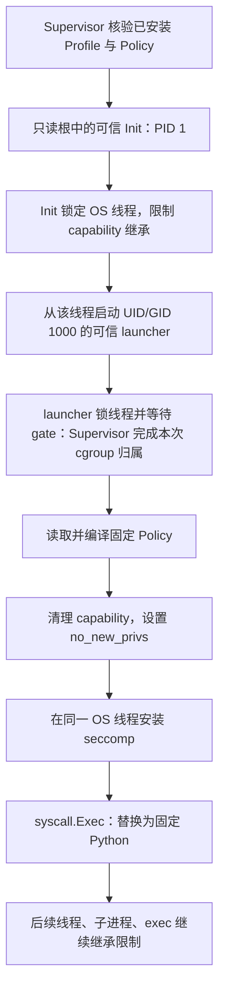

# T08：让 Python 只能调用获准的内核接口

T08 把 Profile Bundle 中原来只有格式与摘要的 System Call Policy 接到了真实执行入口。现在，每次 Python 启动前，可信 launcher 会清理权限、设置 `no_new_privs`、安装 seccomp 过滤器，再把自己替换成 Python。Workload 不能提交自己的策略，也不能因为某次执行失败而要求自动放宽策略。

这张 ticket 回答的是“Workload 可以请求内核做哪些事”。T04 的 namespace、T05 的常驻 Init、T06 的生命周期、T09 的资源预算继续承担各自职责。当前实现仍有 T07 与 T10–T12 的后续合同，不能据此宣称已经完成全部生产安全边界。

## 五种机制分别负责什么

Python 的 `open()`、创建线程、分配内存等操作，最终可能通过系统调用请求 Linux 内核执行。隔离不能只看 Python 语言层面；本地扩展或 `ctypes` 也可以直接发起系统调用。

| 机制 | 它回答的问题 | 本项目中的例子 |
| --- | --- | --- |
| namespace | 进程看到哪一组系统资源？ | Sandbox 有独立 PID 视图、挂载视图与身份映射 |
| cgroup | 这一组进程最多消耗多少资源，由谁一起清理？ | T09 的 CPU、内存、PID 预算，以及 Execution 后代终止 |
| capability | 线程拥有哪些被拆分出来的特权？ | Workload 不保留挂载、改身份等特权 |
| `no_new_privs` | 后续 `exec` 能否借可执行文件获得更多权限？ | 执行带 setuid 或文件 capability 的程序也不能借此提权 |
| seccomp | 哪些系统调用及参数组合可以到达内核实现？ | 拒绝 `mount`、`ptrace`、`bpf` 和创建 namespace 的 `clone` 形式 |

这些机制组合使用：允许 `openat` 不意味着可以打开任意宿主文件，路径可见性和文件权限仍然生效；允许创建普通进程，也不取消 cgroup 的任务数量限制。seccomp 本身不是完整 Sandbox，Linux 内核文档也明确说明了它的职责边界。参见 [seccomp filter 文档](https://docs.kernel.org/userspace-api/seccomp_filter.html)。

## 一次 Execution 怎样进入限制



前三段沿用现有信任关系：Operator 管理 Profile，Supervisor 验证并建立 Sandbox，Init 通过私有管道接收执行请求。Workload 只提供 Python 源码和标准输入，协议中没有自定义 Policy、可执行文件路径或提权开关。

gate 仍解决 T05 的归组时间窗口：先让可信 launcher 等待，Supervisor 确认它已进入 Execution cgroup 后才放行。seccomp 则在不可信 Python 开始执行之前安装。二者保护的是不同阶段，都必须发生在 Python 的第一条指令之前。

读入 Policy、解析 JSON、编译过滤器安排在安装 seccomp 之前。否则可信准备过程也必须被 Python 白名单覆盖，容易因为准备过程自己的文件操作失败而无法启动；这段准备代码固定且可信，不能调用 Workload 源码。

## 为什么 UID 1000 还不够

UID/GID 决定传统文件权限与身份检查，但 Linux 已把原来 root 的很多权力拆成 capability。普通 UID 也可能通过配置获得某些 capability；未来的 `exec` 还会触发一套权限转换规则。因此，测试 `os.getuid() == 1000` 只能证明身份，不能证明全部权限都已清除。

Linux 用五个集合描述线程的 capability 状态：

| `/proc/self/status` 字段 | 名称 | 初学时应抓住的含义 |
| --- | --- | --- |
| `CapEff` | Effective | 内核进行特权检查时实际使用的集合 |
| `CapPrm` | Permitted | 当前线程可以启用为 Effective 的权限范围 |
| `CapInh` | Inheritable | 参与 `exec` 后权限计算的可继承集合 |
| `CapBnd` | Bounding | 限制 `exec` 从文件获取 capability 等继承途径的集合 |
| `CapAmb` | Ambient | 普通程序 `exec` 时可携带过去的权限集合 |

注意 Bounding 不是“立即撤回已有权限”的总开关，单独清空它也不自动清空 Inheritable。因此这里会分别处理集合，不能只调用一次 `PR_CAPBSET_DROP` 就认为工作结束。完整规则见 [capabilities(7)](https://man7.org/linux/man-pages/man7/capabilities.7.html)。

Init 与 Workload 的处理分为两步：

1. Init 在创建子进程的线程上清空 Bounding、Inheritable、Ambient；暂时保留现有 Effective、Permitted，以便可信 PID 1 为下一次 Execution 设置 UID/GID 并管理子进程。
2. `os.StartProcess` 将 launcher 设为内部 UID/GID 1000、清空补充组；launcher 再显式清空 Effective、Permitted、Inheritable、Ambient。Bounding 已从受限父线程继承为空。

为什么不把所有 capability 都在 Init 上清空？Init 下一次还要创建普通身份子进程，提前删除改 UID/GID 所需能力会破坏 Sandbox 复用。当前设计把“可信管理者继续管理”和“给不可信后代传递零权限”分开实现；它没有声称已经把可信 Init 自身的现有权限缩减到逐项最小集合。

`no_new_privs` 则封住后续 `exec` 获得新权限的路径。设为 1 后不能恢复为 0，并会随派生和 `exec` 继承。它不会撤销已有 capability，所以顺序是先清理能力，再设置这项承诺。参见 [PR_SET_NO_NEW_PRIVS](https://man7.org/linux/man-pages/man2/PR_SET_NO_NEW_PRIVS.2const.html)。

## 为什么两处都要锁定 OS 线程

Go 的 goroutine 可以在不同 OS 线程之间移动，而这里修改的 capability、`no_new_privs` 和 seccomp 状态涉及调用线程。源码上相邻的两行 Go 调用，不能仅凭相邻就认定它们一定操作同一个 OS 线程。

Init 的 `RunInit` 从入口永久调用 `runtime.LockOSThread()`，后续每次 `os.StartProcess` 都在这个 goroutine 中执行。这样，清理过继承集合的线程就是创建 launcher 的线程。只限制启动时的“主线程”，随后让执行 goroutine 自由迁移，会让子进程可能从另一条尚未收紧的线程继承状态。

launcher 的 `RunInitWorkload` 也锁线程，让清理权限、安装过滤器与 `syscall.Exec` 发生在同一个 OS 线程上。两条路径失败后都让相应程序结束，不把已修改安全状态的线程放回 Go 的线程池。可以结合 [Go 的 fork/exec 实现](https://go.dev/src/syscall/exec_unix.go) 阅读这条调用路径。

这里没有使用 `SECCOMP_FILTER_FLAG_TSYNC` 把过滤器同步给 launcher 的全部线程，因为 Python 尚未启动，其他 Go 线程只执行可信运行时代码；成功 `execve` 会销毁调用线程之外的线程，Python 从已受限线程接续执行。此后新建的线程、进程会继承过滤器。相关语义见 [execve(2)](https://man7.org/linux/man-pages/man2/execve.2.html) 与 [seccomp(2)](https://man7.org/linux/man-pages/man2/seccomp.2.html)。

这是当前“可信 launcher → exec 不可信程序”的设计前提。将来若改为在现存多线程进程内嵌入 Python，或允许其他线程提前执行 Workload，就必须重新设计同步安装边界，不能直接照搬这套做法。

把 Python 的过滤器提前安装到整个 Init 也有代价：Init 的控制通信、降身份和长期进程管理需要不同操作，最终会迫使 Python 策略为管理者放宽，或使下一次执行失败。单独的 launcher 让两者拥有不同权限需求。

## 白名单如何表达，而不是只列几个危险调用

当前 [System Call Policy](../../profiles/python-data-v1/system-call-policy.json) 以 Linux/amd64 为目标，默认拒绝，只有明确的 `allow` 规则能放行。正常拒绝返回 `EPERM`。共享的 `internal/systemcallpolicy` 负责把版本化 JSON 解析为策略，再编译为内核接收的 classic BPF（cBPF）程序。

| 选择 | 优点 | 本项目要承担的代价 |
| --- | --- | --- |
| 默认拒绝，只允许已评审的调用 | 新增或遗漏的系统调用天然不可用；可按 Profile 审查需要的接口 | Python、libc 或依赖升级可能缺调用，需要代表负载回归 |
| 默认允许，只拒绝已知危险调用 | 初期兼容工作较少 | 容易遗漏新接口、替代接口和危险参数形式，评审面更大 |

本项目选择白名单是 [ADR 0019](../adr/0019-bind-a-system-call-allowlist-to-each-runtime-profile.md) 规定的 Profile 合同。Runtime Lab 可以通过受控实验发现缺失调用，但必须经过 Operator 审查和 Profile 测试，形成新版本；不能把线上拒绝日志直接变成自动放行清单。

规则不只看名字。以 `clone` 为例，同一系统调用既能创建普通线程/进程，也能请求新的 namespace。如果为了兼容线程而无条件允许 `clone`，就可能同时开放不需要的隔离环境创建能力。

当前策略用 `masked-equal` 检查 flags：

```text
(flags & 禁止位掩码) == 0
```

禁止位掩码是明确允许的 flags 集合的补集，因此任何不在允许集合内的位都被拒绝，包括创建 namespace 的位以及未知位。它比只检查几个已知 `CLONE_NEW*` 位更保守，也更容易因未来合法新位而需要更新策略。

为什么不顺便开放 `clone3`？它把 flags 放在指针指向的结构体中，seccomp cBPF 只能看到参数值，不能安全解引用读取结构体。当前 Profile 直接拒绝整个 `clone3`，普通线程/进程兼容性由现有 `clone` 路径验收。换 libc 或运行时版本时必须重测，不能假定所有实现都会在 `EPERM` 后自动回退。

对于参数比较，内核提供的是完整 64 位寄存器值，而 cBPF 运算单位为 32 位。编译器需要分别检查高、低两半；只检查低 32 位，可能把带额外高位的参数错当成合法值。当前支持的 `equal`、`not-equal`、`less-than`、`less-or-equal`、`greater-than`、`greater-or-equal`、`masked-equal` 七种运算全部采用无符号 64 位语义，不能让最高位为 1 的数被误当成负数。

## 一次真实的线程兼容性排查

最初的白名单能运行普通 Python、子进程和已有生命周期/资源回归，但新增的标准库数据处理与 `ThreadPoolExecutor` 测试在创建线程时失败。这说明“能打印文字”甚至“能创建子进程”，都不足以证明同一 Profile 的线程路径可用。

排查在专用虚拟机中做了只改变 `clone` flags 掩码的对照实验，定位到当前锁定运行时使用的 `CLONE_DETACHED` 位。它是历史遗留位，普通 `clone` 通常忽略它；与 `CLONE_PIDFD` 等组合有例外，因此仍需检查允许集合，而不能笼统认为所有旧位都安全。参见 [clone(2)](https://man7.org/linux/man-pages/man2/clone.2.html)。

审阅后，策略将该位加入普通线程兼容所需的允许集合，当前允许位为 `0x017d4fff`；JSON 中保存的禁止位补集为 `18446744073684561920`。`CLONE_PIDFD`、创建 namespace 的位和未审阅的高位仍在拒绝范围内。对照实验中线程创建恢复，修正已写入版本控制中的 Profile 策略。

修正针对已经定位到的参数需求：`clone3` 继续拒绝，默认拒绝继续返回 `EPERM`，没有改为 `ENOSYS` 来尝试触发另一种 libc 的回退逻辑。这也是维护白名单的实际成本：让代表负载暴露缺口，用单变量实验定位，再评审具体新增权限。

## 为什么先检查架构和 ABI

系统调用编号不是跨架构的统一编号。同一个整数在 x86-64 和另一种 ABI 中可能代表不同操作，因此过滤器先核对 `seccomp_data.arch`，再检查系统调用编号；还要单独拒绝同用 x86-64 架构标记的 x32 调用形式。

只有确认是支持的 Linux amd64 原生 ABI 后，才进入规则匹配；其他架构与 x32 在当前策略下直接返回 `EPERM`。否则“只允许编号 N”的代码，可能在另一套编号解释下放行了不同操作。当前策略和编译器没有声称支持 arm64、i386 或 x32；扩平台需要独立的编号映射、参数规则与真实内核测试。

这部分细节以及指针不可解引用的限制，见 [Linux seccomp filter 文档](https://docs.kernel.org/userspace-api/seccomp_filter.html) 和 [seccomp(2) 的 ABI、参数说明](https://man7.org/linux/man-pages/man2/seccomp.2.html)。

## 为什么把 Policy 绑定进不可变 Bundle

只写一个正确的 JSON 还不够。如果 Workload 能替换它，或者 Supervisor 校验的是外层文件、launcher 读的却是另一份文件，策略就没有形成完整信任链。

当前策略作为独立 Profile Bundle 组件参与摘要，并在安装时物化到 rootfs 的固定 `/system-call-policy.json`。这一路径属于安装布局的保留位置；运行时归档不能用普通文件、目录后代或符号链接抢占它。安装后文件归宿主 root 所有、模式为 `0444`，运行时 Profile 根挂为只读。

创建 Sandbox 前，Supervisor 通过可信目录句柄打开实际文件，核对类型、所有者、权限模式、大小及 manifest 中的 SHA-256，再解析和编译策略。launcher 读取的就是只读根内这份固定副本，并再次做文件边界与解析检查。

任何缺失、摘要不匹配、未知规则、参数错误或不支持的目标，都走拒绝路径，不能退回空策略或无过滤执行。启动 launcher 后安装过滤器失败，也不会执行 Python。

保留独立组件后，修改策略会改变策略组件与完整 Bundle 身份，不必把未改变的 Python rootfs 组件也重新定义。代价是安装器与 Supervisor 多维护一个受验证位置。这沿用 [ADR 0020](../adr/0020-distribute-immutable-runtime-profile-bundles.md) 和 [Profile Bundle 合同](../profile-bundle-v1.md)。摘要只绑定内容；可信配置中批准的 Bundle 身份仍是信任起点。

## 为什么自己生成 cBPF

cBPF 是交给内核验证和执行的短过滤程序，不是在 Go 里循环检查每次系统调用。共享解析器让构建/安装检查与启动检查使用同一份策略语言；编译器负责把规则变成实际内核分支。

| 实现方法 | 适合之处 | 本项目采用时的成本 |
| --- | --- | --- |
| 直接生成有限范围的 cBPF | 可以静态构建 Go Init；参数、跳转与 ABI 检查都可学习和测试 | 自己负责编号表、跳转正确性、边界与平台覆盖 |
| 使用成熟 seccomp 库 | 可复用规则构造、架构维护等能力 | 常见 libseccomp 方案会增加原生库与构建依赖，仍须定义策略和权限时机 |
| 委托 runc 等外部运行时 | 适合复用成熟容器生命周期与安全配置 | 要对接额外运行时与配置合同，本项目已有 Init/Supervisor 的学习范围也会改变 |

这并不说明手写过滤器天然更安全。当前取舍是支持一个固定架构和较小策略语言，配合解释器层面规则测试及真实内核探针；若目标变成跨平台生产运行时，维护成熟库或外部运行时的方案应重新评估。

## 拒绝后，Execution Result 表达什么

普通策略拒绝返回 `EPERM`，Python 可以捕获 `PermissionError`，也可以用 `ctypes` 读到 errno。捕获后继续运行并以 0 退出是合理行为；未捕获异常则通过 traceback 与非零退出码表现出来。后续 Execution 仍应能使用同一个 Sandbox。

因此，本次沿用 `exit_code`、`stdout`、`stderr` 观察结果，没有给每个拒绝增加内核审计计数或独立 terminal reason。不能把所有 `PermissionError` 标记为 seccomp 违规，因为普通文件权限、capability 和其他机制也能返回相同错误。

默认直接杀进程能让违规立即终止，但会减少程序探测能力与正常回退机会；返回 errno 保留了兼容性和可诊断性，代价是单看退出码无法统计所有尝试过的禁止操作。验收必须主动检查明确的 syscall 与 errno。

## 建议按调用流读代码

| 顺序 | 位置 | 要回答的问题 |
| --- | --- | --- |
| 1 | [Profile 策略](../../profiles/python-data-v1/system-call-policy.json) | 默认动作是什么，哪些调用必须检查参数？ |
| 2 | [Bundle 安装](../../internal/profilebundle/install_linux.go) | 独立策略组件怎样变成 rootfs 内的可信副本？ |
| 3 | [创建前 Profile 校验](../../internal/sandboxsupervisor/profile_init_linux.go) | Supervisor 核验的字节是否就是 launcher 会读取的字节？ |
| 4 | [Init 与 launcher](../../internal/sandboxsupervisor/init_linux.go) | 哪个线程创建子进程，gate 与 exec 在什么位置？ |
| 5 | [权限处理](../../internal/sandboxsupervisor/privileges_linux.go) | 为什么 Init 清三类集合，Workload 最终五类都为空？ |
| 6 | [策略加载与安装](../../internal/sandboxsupervisor/seccomp_linux.go) | 读取、解析、编译、安装中的任一步失败会怎样？ |
| 7 | [共享解析器](../../internal/systemcallpolicy/policy.go)、[cBPF 编译器](../../internal/systemcallpolicy/compile.go) | 架构守卫、完整参数比较和默认拒绝如何变成 cBPF？ |
| 8 | [Linux 安全验收](../../tests/sandbox_security_linux_test.go)、[64 位参数验收](../../tests/sandbox_policy_arguments_linux_test.go) | 怎么区分“确实被 seccomp 拒绝”与“本来就没有特权”？ |

先从一次正常 `print` 走到返回结果，再挑一个禁止调用走错误分支，最后沿一次子进程 `exec` 检查权限继承。这样可以把机制与真正的调用边界连起来。

## 在 Linux 上亲手验收

准备专用 Linux amd64 环境、符合 `go.mod` 的 Go、util-linux、可用的 root/`sudo` 权限、cgroup v2，以及通过摘要校验的 Profile 源码缓存。构建和运行入口沿用 [T05 的脚本](../../tests/run-sandbox-init-linux.sh)：

```sh
PROFILE_BUNDLE_SOURCE_CACHE=/absolute/path/to/verified-source-cache \
  SANDBOX_TEST_RUN='^TestSandboxExecutionSecurity' \
  bash tests/run-sandbox-init-linux.sh
```

完成安全专项后，再跑同一入口的默认 Execution、生命周期与资源回归，确认策略不会破坏 Sandbox 复用、后代清理和已有正常负载：

```sh
PROFILE_BUNDLE_SOURCE_CACHE=/absolute/path/to/verified-source-cache \
  bash tests/run-sandbox-init-linux.sh
```

脚本构建真实 Init 与锁定 Python Bundle，在专用 mount/PID/network namespace 和受控 cgroup 下执行。不要把过滤器安装到承载测试的 Go 主进程或交互 shell：限制不可撤回，会干扰其余用例。本次通过受控 Sandbox 子进程执行真实探针，父进程接收结果，这就是安全的测试 seam（可独立验收的边界）。

64 位参数测试由可信测试代码构造独立 Bundle，保留生产规则，只增加一条受参数限制的 `getpriority` 规则，并按新摘要安装。该调用只使用前两个参数，测试把任意 64 位值放入第六个参数寄存器，即 `index=5`：过滤器可以比较它，真正的内核调用会忽略它。这样能无副作用地观察七种运算结果，而且没有向 Workload 协议增加覆盖策略的入口。

本次已在 Linux **6.12.107**、Go **1.26.1** 中取得以下真实内核证据。RED 表示先让缺少实现的测试按预期失败，GREEN 表示补上实现后同一行为通过。

| 验收范围 | 已观察的结果 | 它证明什么 |
| --- | --- | --- |
| 权限状态与子进程 `exec` | 第一轮 RED 为 `NoNewPrivs=0`；实现后 GREEN，五个 `Cap*` 全零且 `NoNewPrivs=1` | 限制出现在实际 Python 中，并跨 `exec` 保留 |
| 过滤器安装与连续执行 | 第二轮 RED 为 `Seccomp=0`；实现后 GREEN，`Seccomp=2`、`getpriority` 返回 `EPERM`，后续执行成功 | 不依赖已有特权拒绝来冒充 seccomp 生效 |
| 参数编译 | 七种运算、59 个真实系统调用探针全部通过，覆盖 `index=5` 和无符号最高位 | 64 位比较及参数位置符合独立编写的期望 |
| 危险调用与替代 ABI | namespace flags、高位 `arch_prctl`、x32、`int 0x80` 等拒绝场景通过 | 架构检查与参数边界在真实内核生效 |
| Policy 安装边界 | 篡改内容、文件缺失、符号链接、可写模式、错误所有者五类场景通过 | 创建前拒绝不可信策略副本，并未留下资源 cgroup |
| 已有行为 | Execution、Lifecycle、Resource 整套回归通过 | 原有顺序执行、生命周期与资源预算仍能工作 |
| 新增线程负载排查 | 只变更 `clone` 掩码的对照实验定位 `CLONE_DETACHED`；最终标准库、线程、子进程负载全部通过 | 兼容问题有明确原因与有限范围的修改 |

最终检查使用相同冻结源码构建物，在 2 vCPU / 4 GiB 的一次性 Linux 虚拟机中全部通过：与 `make check` 相同的格式、`go vet ./...`、普通用户 `go test ./...`、`go build ./...` 和 Shell 语法检查；Sandbox 组 27 个顶层测试及 22 个子测试；Creation 组 10 个顶层测试及 8 个子测试；Profile Bundle 组 18 个顶层测试及 12 个子测试。Bundle 验收包含 root-owned 安装、修改拒绝、真实锁定 Python 标准库和两次字节一致的可复现构建。生产策略的 canonical SHA-256 为 `6047a041a38f29123ac52175fdcbf7b6597645f0706124a34e2b51a07a7ce22d`，验收固定了此摘要。

Profile 当前锁定 musl 与 CPython，依赖清单仍以实际 lock 为准。不要将代表性标准库测试扩大成“所有 Python 包都兼容”；增加 NumPy、pandas 或替换 libc 时，需要重新审查调用需求并发布对应 Profile 版本。

## 面试时怎样讲，以及怎样自测

可以从具体变化开始：原来 Python 已有 namespace 和资源预算，但没有按 Profile 缩小内核接口面；本次把不可变 Bundle 中的白名单安装到 Python 的真实执行入口，同时保证全部 capability 为空、`no_new_privs` 生效，限制继续覆盖后续线程与 exec。

然后挑两个你能讲清楚的难点深入。第一个是“Go 调度与 Linux 线程安全状态的错位”，解释为什么 Init 与 launcher 都必须锁线程。第二个是“同一 syscall 的合法和危险形式”，用 `clone` 的 flags 与 `clone3` 的指针参数说明为什么参数比名字更重要。

最后给证据和边界：指出真实 Linux 测试读取的权限字段、一个普通权限下本应成功却被策略拒绝的调用，以及拒绝后继续执行的场景。T07 的进一步文件系统/挂载强化、T10 的完整存储预算、T11 的完整结果与输出合同、T12 的超时仍需各自实现。

1. namespace 已经隔离了资源视图，为什么还要减少能调用的内核接口？
2. `CapEff=0` 为什么不足以说明未来 `exec` 也无权限？Bounding 与 Inheritable 有什么区别？
3. Init 保留哪些当前权限，为什么它们不会交给 Python？
4. goroutine 在安装 seccomp 后换一个 OS 线程，再 `exec` 会破坏哪个前提？
5. 当前不用 TSYNC 依赖什么条件？改为嵌入式 Python 后还成立吗？
6. 为什么允许普通 `clone` 不等于应该允许全部 flags 或 `clone3`？
7. 为什么过滤器必须先判断 ABI，再解释系统调用编号？
8. 某个危险调用得到 `EPERM`，还缺什么证据才能归因于 seccomp？
9. 未捕获 PermissionError、捕获后正常退出，应该分别怎样出现在 Execution Result 中？
10. Python 升级后少一个 syscall，应由谁审查，为什么不能让 Workload 自己扩白名单？
