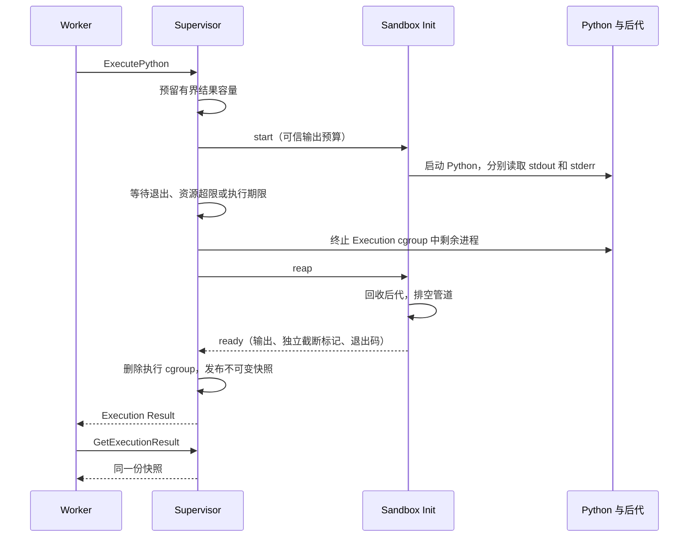

# T11：有界输出与不可变执行结果

T11 要解决的是：一次 Python Execution 即使持续输出、异常退出或超时，调用方仍能得到大小可控、状态明确、可以重复读取的 Execution Result。

## 这次具体增加了什么

- `sandboxd --stdout-bytes` 和 `--stderr-bytes`：默认各 1,048,576 字节；每项可配置为 1 字节到 8 MiB，公开执行请求不能修改。
- 结果中的 `stdout_truncated`、`stderr_truncated`：分别说明哪路内容不完整。原有 `truncated` 保留为两者的逻辑或，终止原因和退出码继续独立表达。
- `get_execution_result` 与 Go 客户端 `GetExecutionResult`：按 Sandbox ID、Execution ID 读取完成快照。进行中的结果返回 `execution_result_not_ready`，未知结果返回 `execution_result_not_found`。
- 结果暂存：整个 Supervisor 最多 64 个槽位、128 MiB 预留输出额度。每次执行预留 stdout 与 stderr 的额度之和；即使输出为空，也保留这份预留直到显式销毁。
- 传输边界：请求仍最多 64 KiB，结果响应最多 96 MiB + 64 KiB，覆盖两路都配置为 8 MiB 时的最坏 JSON 转义。

旧版只是每路捕获 4 KiB，并用一个布尔值表示是否截断。本次保留其连续排空管道的方法，补齐配置、传输、独立元数据和结果读取合同。

更新 Supervisor 后，需要使用匹配的新 Sandbox Init 重新构建并安装 Profile Bundle。输出配置通过新增的私有启动消息字段传递；Bundle 仍通过摘要识别，不能混用旧 Init 并假定私有协议兼容。

## 先理解输出管道

Python 的 stdout 和 stderr 分别连接到一根操作系统管道。管道的缓冲区有限；写入速度超过读取速度时，写入者会阻塞。因此，“只保留前 N 字节”和“只读取 N 字节”是两件不同的事。

本实现为两路输出各保留一个读取 goroutine。每路只保存预算内的前缀，额度满后继续读取并丢弃后续字节，直到 EOF。保留的内存不会随着输出总量增长，Python 也不会因为我们停止读取而被堵在写管道上。无限输出最终仍受 T12 的执行期限和 T09 的 CPU 预算约束。

| 方法 | 好处 | 在这里的问题 |
| --- | --- | --- |
| 将整个输出读入内存 | 实现简单 | Workload 可以让捕获进程持续分配内存 |
| 读到 N 字节就停 | 保存内容有界 | 管道填满后 Python 可能无法继续执行或正常退出 |
| 达到上限就关闭读端 | 无需继续读取 | 写端会遇到 EPIPE／BrokenPipeError，改变程序行为 |
| 有界保留并持续排空 | 限制保存量，同时允许程序继续运行 | 丢失后缀，仍需 CPU 与时间预算限制无限输出 |

stdout 和 stderr 分开读取还避免了另一种死锁：如果先把 stdout 读到 EOF，再读 stderr，Python 可能早已被写满的 stderr 管道阻塞，因而永远无法关闭 stdout。

## 为什么进程退出不等于输出结束

EOF 的条件是所有写端都已关闭。父 Python 退出后，子进程或孙进程仍可能持有 stdout／stderr 的写端。

因此 T11 沿用 T12 的收尾顺序：观察退出或触发期限 → 终止整个 Execution cgroup 并取得最终资源统计 → Init 回收后代 → 两路输出读到 EOF → 删除执行 cgroup 并冻结结果 → 允许下一次 Execution。



如果先无限等待 EOF，后代可能让调用永远挂起。如果只杀 Python 父进程，脱离会话的后代仍可能继续写文件或持有管道。cgroup 提供明确的进程归属范围，Init 则负责回收退出状态；这两项不能互相替代。

## 输出预算和协议消息预算不同

输出以 UTF-8 文本放进 JSON。一个 NUL 字节会变成 `\u0000`，传输时占六个字节；双路各一 MiB 的内容可能生成接近十二 MiB 的 JSON。因此不能把旧的 64 KiB 消息上限直接当作输出预算，也不能只把输出常量调大。

请求继续保持小而有限的消息边界，携带结果的响应使用单独的有限边界。捕获内容的预算、JSON 转义后的消息预算、结果暂存的总预算分别约束不同阶段。

无效 UTF-8 会被替换为合法文本。替换字符可能使文本变长，因此转换后还要按字节预算收缩到合法 UTF-8 边界。这里提供的是有损文本前缀，不是任意二进制文件传输；二进制产物应走后续声明输出文件的路径。

还有一个 Go 内存细节：字符串截短后，仍可能引用整块较大的底层分配。本实现对收缩后的文本再做一次 `strings.Clone`，让长期保存的结果拥有大小符合预算的内存，而不只是表面上的 `len` 符合预算。

## 为什么读取结果不能重新执行

执行 Python 可能修改 Workspace。为了重新获得输出而再运行一次，可能重复写文件或产生不同结果。T11 将已完成结果保存为快照，读取只返回这份快照。

Execution ID 标识一次执行；新的执行使用新的 ID。同一 ID 的重复执行请求不能覆盖先前结果。读取也不会拥有 Sandbox 的取消权，因此一个只读客户端断连不应终止正在进行的其他执行。

Sandbox 正在执行时，新的执行请求仍按原合同返回 `sandbox_busy`。空闲后重用已完成的 ID 返回 `execution_exists`。读取旧快照可以和新 Execution 并发，不需要占有执行锁。

结果本身有界还不够：如果保存结果的表无限增长，Supervisor 仍会耗尽内存。暂存容量应在执行前预留，容量不足时拒绝新执行，同时保留已有结果供读取。静默淘汰旧结果虽然方便，却破坏了调用方重读同一结果的预期。

这里的暂存服务于本机 Worker 接取结果。跨 Supervisor 重启以及 Conversation 生命周期的持久保存属于后续 Control Plane 工作，不由 T11 的内存暂存代替。

| 结果保存方案 | 优点 | 本次没有采用它的原因 |
| --- | --- | --- |
| 只保存最近一次结果 | 内存简单可控 | 下一次执行会使旧 Execution 无法重复读取 |
| 无界 map | 读取直接 | 空输出也能累积无限条目；大输出会累积无限内容 |
| LRU 自动淘汰 | 能持续接收新执行 | 调用方重试读取时，先前结果可能已悄悄消失 |
| 先预留容量，满时拒绝 | 执行前就知道能否接收结果，旧结果稳定 | 预留比实际占用保守，需要及时显式销毁已结束的 Sandbox |
| 立即接入数据库持久化 | 可跨进程重启保存 | 属于后续控制面职责，会扩大特权 Supervisor 的依赖和权限范围 |

Init 意外退出会销毁运行状态，但已经保存的结果仍可读。显式 `DestroySandbox` 成功后再释放结果；清理失败则保留结果供排查。这里说的 128 MiB 是结果输出预留上限，不是整个进程 RSS 上限；编码、解码和并发响应还需要临时内存。

## 建议按这个顺序读代码

| 入口 | 重点 |
| --- | --- |
| [协议类型](../../internal/sandboxsupervisor/protocol.go) | 先看调用方能发什么请求、能得到哪些结果和错误 |
| [输出收集](../../internal/sandboxsupervisor/init_linux.go) | `captureInitOutput` 如何限长并排空，`executeInitWorkload` 为什么先回收后等输出 |
| [消息边界](../../internal/sandboxsupervisor/framing_linux.go) | 请求与结果如何选择不同的长度限制 |
| [结果暂存](../../internal/sandboxsupervisor/results_linux.go) | `reserve`、`finish`、`read`、`removeSandbox` 分别在哪个时刻改变状态 |
| [执行调度](../../internal/sandboxsupervisor/execution_linux.go) | 如何先预留，在收尾后发布快照，并在释放执行锁前完成保存 |
| [结果验收](../../tests/sandbox_result_edge_linux_test.go) | 并发读取、读取中断、Init 丢失、容量拒绝与回收的完整场景 |

留意 `defer` 的执行顺序：后注册的先执行。结果保存必须发生在执行收尾之后、执行锁释放之前，否则第二次执行或销毁可能看见尚未发布的旧状态。

## 在准备好的 Linux 环境复现

普通用户运行项目检查：

```sh
make check
```

准备文档要求的 Profile 源码缓存、root 验收环境和 cgroup v2 委派后，通过已约定的公开 Supervisor 边界运行 T11 场景：

```sh
PROFILE_BUNDLE_SOURCE_CACHE=/absolute/path/to/cache \
SANDBOX_TEST_CGROUP_PARENT=/sys/fs/cgroup \
SANDBOX_TEST_RUN='^TestSandboxExecution(Output|Result|DeadlineKillsDetached)' \
bash tests/run-sandbox-init-linux.sh
```

脚本安装实际 Python Profile，启动真实 Supervisor 和 Init。仅在 Windows 上交叉编译不能证明管道、namespace、cgroup 与进程回收的真实行为。

## 如何检验自己理解了设计

1. 为什么两个 goroutine 比“先读 stdout，再读 stderr”更可靠？请画出 stderr 先写满时的等待关系。
2. 为什么保留前一 MiB，仍然可能读取几百 MiB？区分读取成本与保留空间。
3. 为什么退出码为 7 的程序仍然应返回正常的 Execution Result？区分 Workload 失败与协议失败。
4. 为什么 JSON 消息上限必须比文本预算大？用 NUL 字符算出最坏转义大小。
5. 为什么达到结果暂存容量时要在启动 Python 之前拒绝？考虑程序已经写完文件但无法保存结果的情况。
6. 为什么一个旧结果的读取请求断连，不应销毁 Sandbox？区分读取结果与拥有执行生命周期。

## 实际验证记录

2026-09-07 完成以下实际验证：

| 验证 | 环境与结果 |
| --- | --- |
| 第一个失败测试 | QEMU Linux `6.12.107-0-virt`；两路各写 2 MiB，旧实现返回各 4096 字节，缺少独立截断信息，按预期失败 |
| 可信配置的失败测试 | 同一内核；旧 CLI 拒绝 `--stdout-bytes`，随后实现配置与私有消息传递，使测试通过 |
| 不可变结果的失败测试 | 同一内核；旧协议返回 `unknown_operation`，随后实现快照与读取，使测试通过 |
| 输出与结果定向验收 | 默认预算、独立预算、精确边界、空输出、无效 UTF-8、跨字符截断、非零退出、结果重读与禁止重复执行均通过 |
| 大响应 | 公开 Go 客户端执行并重读：stdout 为 2 MiB NUL，stderr 为 1 MiB `<`，JSON 转义后仍可完整传输 |
| 结果生命周期 | 运行中并发读取、读取途中断连、Init 死亡后重读、显式销毁后不可读均通过 |
| 容量 | 两个 Sandbox 共享 128 MiB 预留额度与 64 槽位上限；满时不执行、不覆盖 Workspace、不淘汰旧结果；销毁后可继续运行 |
| `make check` | Ubuntu Linux `7.0.0-30-generic`、Go `1.26.1`、普通用户；格式、静态分析、普通测试、构建和 Shell 语法检查全部通过 |
| 完整真实内核回归 | QEMU Linux `6.12.107-0-virt`，`^TestSandbox(Execution\|Lifecycle)` 的 38 个顶层测试全部通过，包含 seccomp、资源预算、后代回收与生命周期 |
| 并发竞争检测 | Supervisor 与测试程序启用 `-race`；5 个顶层场景通过，覆盖并发读、读取断连、Init 死亡、容量回收、结果稳定性和连续超时复用；未报告数据竞争 |

完整内核回归实际等待了默认 60 秒期限，并验证配置允许的 66 秒正常执行。这里的测试耗时不是吞吐量或延迟性能指标。

真实内核验收使用 Windows 工作区交叉编译的 Linux 程序与匹配的 Profile Bundle，在只读挂载源码的可丢弃虚拟机中安装运行。普通检查和 `-race` 构建使用同一源码副本，上传包的 SHA-256 在两端一致。竞争检测覆盖 Supervisor 和客户端测试程序，Sandbox Init 使用常规构建；不能据此声称所有进程都经过了 `-race`。

这些证据覆盖 T11 的公开合同，不表示已经完成跨重启持久化、生产 Sandbox 的全部安全验收或真实业务规模压测。

## Standards 审查

独立静态审查发现 0 项硬性规范违例、0 项需要修改的判断性建议。领域用语与 CONTEXT 一致；可信预算、隔离边界与顺序执行符合 ADR-0014、0015、0016；结果发布位于清理之后、执行锁释放之前，未发现新增锁顺序冲突。测试通过公开客户端、协议和宿主生命周期不变量观察行为，不依赖私有结果表结构。

## Spec 审查

独立静态审查发现 0 项缺失、范围扩张或实现错误。T11 的默认双流额度、独立截断标记、明确终态与重复快照读取均已实现。有限暂存、重复 ID 拒绝、JSON 转义容量和显式销毁回收为这些合同提供支持，未引入后续 Control Plane 的持久化职责。两项审查均未重复执行主任务的测试。

审查合计：Standards 0 项，Spec 0 项；两轴均无未解决问题。
