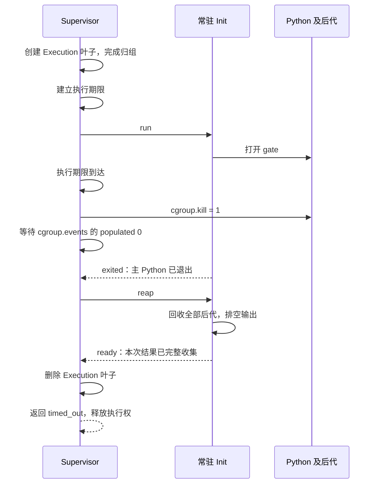

# T12：执行超时后，怎样让同一个 Sandbox 继续工作

T09 已经限制了 CPU、内存、swap 和 PID，但这些 cgroup 预算本身不能限制程序总共运行多久。原系统另有固定 60 秒的通信保护，保护到期会使 Sandbox 失效，无法交付一个可复用环境中的超时结果。T12 补上每次 Execution 的执行期限：可信 Supervisor 到期后终止该次 Execution 的全部进程，完成回收，再返回 `timed_out`。只要 Init 和清理握手正常，同一个 Sandbox 可以继续执行下一段 Python，Workspace 中已有的文件也保留。

本文对应 [T12 / #18](https://github.com/TH1NKING/Build-your-own-Docker-with-Go/issues/18)，延续 [ADR-0014 的默认资源预算](../adr/0014-start-with-conservative-sandbox-resource-budgets.md) 与 [ADR-0016 的常驻 Init](../adr/0016-keep-one-sandbox-init-per-agent-run.md)。这次工作的核心，是把“期限到了”落实成一条有完成条件的清理流程。

## 先看一个能解释项目价值的场景

假设 Agent 先在 Workspace 生成了一份中间文件，随后运行的 Python 卡在死循环。平台需要终止这次计算，让 Agent 得到明确的超时结果，并继续使用之前生成的文件修正代码。

这要求同时成立三件事：旧 Python 及其后代不能继续运行；可信 PID 1 仍然可用；下一次 Execution 开始时，旧执行的进程、输出管道和协议消息已经处理完毕。只是在 Go 函数里返回 `context deadline exceeded`，无法证明这些条件成立。

你可以把最终演示组织成四步：写入 `state` 文件后开始死循环；收到 `timed_out`；检查旧 Execution 的 cgroup 已删除；在同一个 Sandbox 读回 `state`，同时确认 Init 的宿主 PID 没变。这样展示的是一次失败后的继续执行能力。

## 这次改变了哪些合同

| 位置 | 变化 | 为什么放在这里 |
| --- | --- | --- |
| `ResourceBudget.ExecutionTimeout` | 每次 Execution 获得有限执行时长，默认 60 秒 | 与其他可信资源预算统一配置 |
| `sandboxd --execution-timeout` | Platform Operator 可以在启动 Supervisor 时配置时长 | Workload 和普通 Worker 请求不能自行延长期限 |
| Execution 的等待流程 | 在发送 `run` 放行之前建立期限，到期进入整组终止与回收 | 避免不可信代码先运行、计时后启动的空档 |
| `terminal_reason` | 新增 `timed_out` | 调用方能区分超时、普通退出和已有资源超限原因 |
| 真实 Linux 验收 | 检查超时、后代清理、Init 存活与 Workspace 复用 | 返回一个错误或通过编译都不足以证明内核状态正确 |

零或负时长不是“无限制”的简写，启动配置应直接拒绝。给每次请求增加一个可自由选择的 `timeout` 看起来方便，但会让普通调用方决定自己受多大的资源约束。未来如果需要分档，可以设计可信策略选择；当前公开请求保持封闭。

## 三种等待时间不能混为一谈

| 时间 | 谁负责 | 到期意味着什么 |
| --- | --- | --- |
| 客户端 context 的等待时间 | Worker 侧调用者 | 调用者不再继续等待；当前请求中断后，沿用 T06 的 Sandbox 终止规则 |
| Execution 的执行期限 | Supervisor 的可信 Resource Budget | 结束当前 Workload 及全部后代；清理成功后允许复用 Sandbox |
| Init 控制管道的通信保护 | Supervisor 的内部协议 | 可信组件没有按约定完成握手，无法继续把 Sandbox 当作正常状态 |

T12 之前，执行代码里已有固定 60 秒的管道读写保护。它能避免 Supervisor 无限等待一条消息，但还不能表达“正常的执行超时结果，并保留 Sandbox”。将这一个数字改成配置值仍然不够：如果超时只导致读取失败，原有失败路径会终止 Init，使 Sandbox 整体失效。

执行期限结束后，仍需要时间做 `cgroup.kill`、等待进程退出、让 Init 回收、读取结果和删除 cgroup。因此通信保护必须给这些步骤留出独立的收尾窗口。复用已经到期的读取期限，会使后续 `exited` 或 `ready` 消息即使正常产生，也无法被读取。

本次为 Init 的启动与最终回收握手分别设置 5 秒保护；正式等待 Workload 时清除启动阶段的读取期限，触发终止后再给退出消息设置 5 秒保护。公开 Worker 连接的响应写入期限也改为在结果准备好后才开始计算，否则在接收请求时设置的旧 5 秒期限会让一次合法的较长 Execution 无法交付结果。

同理，Workload 持续输出不应刷新执行期限。按最后一次输出重新计时适合“空闲超时”，但一段定期打印的死循环可以永远保持活跃，无法满足固定执行预算。

## 为什么从 `run` 放行前开始计时

一次 Execution 的启动顺序已经由 T05/T09 建立：创建 Execution cgroup，通知 Init 启动可信 launcher，launcher 在私有 gate 上等待；Supervisor 确认宿主 PID、完成归组并撤销继承的 OOM 保护，最后发送 `run` 才允许它执行 Python。

T12 把期限建立在最后这个放行边界之前。这样，Python 启动和后续运行都处于同一段预算内，Workload 没有机会在计时开始前执行。前面的受信任准备工作由启动与通信保护约束，不需要把它含糊地混进 Python 的执行时长。

采用 `time.Now().Add(timeout)` 保留 Go 的单调时钟信息，之后通过时间比较或剩余时长等待来测量持续时间。单调时钟适合回答“已经过了多久”，不会因为墙上时钟被校准就突然多出或少掉一段执行预算。把时间先转成 Unix 秒再算差值，会丢失这一点。[Go 的单调时钟说明](https://pkg.go.dev/time#hdr-Monotonic_Clocks)

执行期限表示到期触发终止，客户端看到结果还包含调度、杀进程与回收的耗时。因此配置 `500ms` 不等于承诺 RPC 必定在第 500 毫秒返回。验收应检查没有提前到期，并给实际清理留下合理且有界的完成时间；它不是实时系统的精度测试。

## 为什么用 Execution cgroup，而不是只杀一个 PID

沿用 T09 的结构即可区分两个终止范围：

```text
Sandbox 预算父组
├── Init 叶子：常驻可信 PID 1
└── Execution 叶子：本次 Python 与它产生的全部后代
```

超时只向 Execution 叶子的 `cgroup.kill` 写入 `1`。Linux 对目标 cgroup 子树内的进程发出 `SIGKILL`，并处理终止过程中的并发 fork；它比在用户态先枚举 PID、再逐个发送信号更适合这个边界。[Linux cgroup.kill 合同](https://docs.kernel.org/admin-guide/cgroup-v2.html#core-interface-files)

前提仍然是启动时正确归组，且 Workload 无权把自己迁出可信 Supervisor 管理的边界。不能把 cgroup 理解成无论怎么配置都能自动找到任意历史后代的追踪器。

| 方案 | 适合的地方或优点 | 在本项目中的不足 |
| --- | --- | --- |
| 只取消 Go context | 让合作的 goroutine、I/O 和请求停止等待 | context 只是信号；需要代码把它转成进程终止与清理动作 |
| 只 kill 主 Python PID | 目标直接，实现简单 | 后台子孙可能继续计算、写文件或持有输出管道 |
| kill 进程组 | 适合由 shell 管理、遵守进程组约定的命令 | 子进程可改变进程组或创建新会话；进程组本身不是完整后代边界，参见 [setsid](https://man7.org/linux/man-pages/man2/setsid.2.html) |
| 遍历 `/proc`，递归查找子进程再 kill | 便于观测与诊断进程关系 | 枚举与发送信号之间仍会 fork、退出或重新托管，快照容易失效 |
| 终止 Sandbox Init | 在 Sandbox 整体结束或状态不可信时，提供统一终止路径 | PID 1 消失使该 PID namespace 无法继续创建进程，破坏同一 Sandbox 的复用合同 |
| kill Execution cgroup | 用既有的内核成员边界覆盖本次执行及后代，同时保留 Init | 需要 cgroup v2、可信归组、权限配置，以及显式等待和回收 |

这里使用直接 `SIGKILL`，不额外增加由 Workload 自愿退出的宽限阶段。它适合不可信代码的硬性终止策略。先发 `SIGTERM` 再等待，能让合作程序保存状态，但不可信 Workload 可以忽略它，平台也必须定义宽限时间算不算预算。直接终止的代价是 Python 的 `finally` 或退出清理不保证执行；保留 Workspace 不等于把未完成写入自动变成一致的事务。

Init 的存活与 PID namespace 的可复用性由 Linux 的生命周期规则决定。Init 死亡后，该 namespace 中的其余进程会被终止，也不能通过重新启动另一个“PID 1”恢复原 namespace。[Linux PID namespace 的 Init 语义](https://man7.org/linux/man-pages/man7/pid_namespaces.7.html)

## `kill`、退出、回收、可复用分别是什么



图里的 `exited` 可能在观察到 `populated 0` 之前就已经进入管道；关键约束是它必须被本次 Execution 的读取者消费，且确认整组没有活进程之后才进入最终回收握手。

这些阶段分别提供不同的证据：

1. **`cgroup.kill` 写入成功**：内核接受了整组终止动作。
2. **`populated 0`**：该组及子组已经没有活进程。它不是“所有退出状态都已回收”的证明。[Linux populated 的定义](https://docs.kernel.org/admin-guide/cgroup-v2.html#un-populated-notification)
3. **消费 `exited`**：本次主 Python 的退出阶段已经到达，私有协议推进到了正确位置。
4. **`reap → ready`**：Init 等到没有待回收子进程，并完成输出收集，可以接收下一次 `start`。
5. **删除 Execution cgroup**：旧执行的内核管理对象已清理，才能交付可复用状态并释放执行权。

`kill` 不负责回收。进程终止后，内核仍可能保留退出状态供父进程读取；父进程调用 wait 系列操作才完成这部分工作，否则会留下僵尸进程。[Linux wait 的回收语义](https://man7.org/linux/man-pages/man2/wait.2.html)

Init 只让一条等待路径管理子进程退出状态，避免 `Process.Wait` 与 `Wait4(-1)` 互相抢走结果。等待主 Python 时可以顺便回收已退出后代；Supervisor 杀空 Execution 组后，再让 Init 等到 `ECHILD`，确认已经没有可回收的孩子。这是 T05 已有机制，T12 把超时接到同一条可信结束路径上。

## 为什么超时后还要消费一次 `exited`

Supervisor 同时等待期限和 Init 的退出消息。超时分支胜出时，负责读 `exited` 的 goroutine 可能仍在读取。此时若立刻再起一个读取者等 `ready`，两个读取者会共享同一条帧流，某一方可能读走另一方期待的消息。更糟的是，一个已经不再受管理的旧读取者可能影响下一次 Execution。

因此，期限到达不代表可以抛弃当前读取者。实现先触发终止，用有界的通信保护等待这一条读取完成，随后再发送 `reap` 并读取 `ready`。如果等待函数因资源观察失败或 Sandbox 取消提前返回，会把当前读期限设为“现在”，唤醒阻塞读取并等它交回结果，然后才离开等待函数。这让旧 goroutine 不会跨过执行边界。

这里只创建一个用于本次等待的 goroutine，比把每个协议阶段都拆成独立异步任务更容易建立所有权。它仍需要明确的结束条件；“启动到后台”不等于“已经有人负责清理”。

## 正常退出和期限同时到达时怎么办

设 Python 在期限附近退出，而 Supervisor 同时发现计时器已到期。Go 的 `select` 不承诺“代码写在前面的分支优先”，所以不能仅靠调换分支顺序来定义结果。[Go select 规范](https://go.dev/ref/spec#Select_statements)

当前实现的裁决规则是：期限分支被选中后，先非阻塞检查本次 `exited` 读取是否已经完成；已经完成就优先消费这个结果。若没有已交付的读取结果，记下 `timedOut=true`，触发整组终止。正常退出分支直接收到结果时，则沿原有清理路径完成。

这是一条以 Supervisor 观察为基础的边界规则。当前控制协议没有提供一个可直接比较的精确内核退出时刻，因此它不能还原“Python 恰好比期限早 1 纳秒退出”的事实。工作重点是不给同一次 Execution 产生两个结果、不让已消费的退出消息留给下一次执行，并在裁决后完成相同的清理条件。

同一时刻还可能出现 OOM 或 PID 上限事件。本项目把 `SIGKILL` 终止映射为 `exit_code=137`，但程序也可以主动调用 `sys.exit(137)`，所以这个数字连“确实收到过 `SIGKILL`”都不能独立证明。即使确认了信号，超时、资源处理和显式销毁也都可能使用它。终止原因应来自 Supervisor 的期限状态和宿主资源证据，不能从退出码猜测。

最终主原因的优先级沿用资源证据优先的规则：`memory_limit` → `pids_limit` → `timed_out` → `exited`。例如，已经触发超时，同时读到本次 OOM 事件增量，结果选择 `memory_limit`，同时保留资源统计。这个顺序是平台对重叠证据的分类政策，不能据此断言 OOM 在时间上一定先于期限。

## 哪些失败会使整个 Sandbox 失效

可复用要求 Init 仍然可信并且清理成功。如果 `exited` 缺失、`ready` 失序、控制管道失效，或 cgroup 无法可靠清理，就不能为了保住 Workspace 而继续接收下一次执行。旧状态不确定时，新的 Python 可能与旧后代重叠，也可能读到错误的协议消息。

现有失败路径终止 Init，进入 T06 的 Sandbox 整体收尾。清理未成功的资源仍由 Sandbox 持有，以便现有销毁流程继续处理；返回某个有证据的终止原因，也不代表可以跳过清理确认。

取消沿用同样的生命周期边界：客户端中途放弃已经取得所有权的请求，显式调用 `DestroySandbox`，或 Supervisor 关闭，都会终止整个 Sandbox。T12 没有新增“只取消本次 Execution，并保持 Sandbox”的公开 RPC。实现这样的细粒度取消还要处理请求身份、取消与完成竞态，以及调用方如何确认结果，不能用客户端 context 偷偷代替这份合同。

## 按这个顺序读代码

| 顺序 | 文件 | 带着什么问题阅读 |
| --- | --- | --- |
| 1 | [资源预算](../../internal/sandboxsupervisor/resource_budget_linux.go)、[启动入口](../../cmd/sandboxd/main_linux.go) | 谁能配置期限，默认值和非法输入是什么？ |
| 2 | [Execution 流程](../../internal/sandboxsupervisor/execution_linux.go) | 计时何时开始，到期谁负责 kill，谁拥有响应读取？ |
| 3 | [cgroup 管理](../../internal/sandboxsupervisor/cgroup_linux.go) | 如何确认没有活进程，删除失败后谁还持有资源？ |
| 4 | [Init 协议](../../internal/sandboxsupervisor/init_linux.go) | `exited` 和 `ready` 各自承诺什么，为什么还要 `reap`？ |
| 5 | [公开结果](../../internal/sandboxsupervisor/protocol.go) | 终止原因与退出码为什么是不同字段？ |
| 6 | [生命周期](../../internal/sandboxsupervisor/lifecycle_linux.go) | 超时为何可以保留 Sandbox，断线取消为何仍整体结束？ |
| 7 | [期限验收](../../tests/sandbox_deadline_linux_test.go)、[执行失败验收](../../tests/sandbox_execution_failure_linux_test.go) | 哪些断言证明后代已清理，哪些证明环境确实被复用？ |

第一遍只追“死循环到期，但 Init 正常”的路径。第二遍假设 Init 不再回复，观察哪些状态不再允许复用。最后再读正常退出与期限竞态，容易看清每一个错误处理为何存在。

## 在 Ubuntu 上怎样验证

真实进程与 cgroup 行为需要 Linux 验收。仓库提供的 [执行测试脚本](../../tests/run-sandbox-init-linux.sh) 会构建 Supervisor、Init 与测试程序，并在独立 mount/PID/network namespace 中安装 Python Profile 运行场景。Profile 源码缓存、root 权限与 cgroup 委派的准备方法见 [Supervisor 配置合同](../sandbox-supervisor-protocol-v1.md) 和 [T05 学习笔记](t05-sandbox-init.md)。

在已经准备好上述条件的 Ubuntu 仓库根目录，先运行配置和协议的普通检查，再执行真实 Linux 场景：

```bash
make check

SANDBOX_TEST_RUN='^TestSandboxExecutionDeadline' \
  bash tests/run-sandbox-init-linux.sh

bash tests/run-sandbox-init-linux.sh
```

普通 `go test ./...` 不会自动包含带 `sandbox_root,profilebundle_root` 标签的内核验收。只看普通测试通过，就无法判断 `cgroup.kill` 是否真的生效。

重点检查这些证据：

| 场景 | 应观察的结果 |
| --- | --- |
| 客户端给 10 秒，Supervisor 给 500 毫秒，Python 死循环 | 客户端仍在等待时收到 `timed_out`，证明期限来自 Supervisor |
| Python 先写 Workspace，再超时 | 下一次执行读取到文件，Init 的宿主 PID 与之前一致 |
| Workload 留下子孙进程或持有输出管道 | 结果返回前后代被清理，下一次执行只能看见 Init 和当前 Python |
| Python 在期限前正常退出 | 返回 `exited`，下一次执行不受旧计时器或旧协议消息影响 |
| Workload 持续输出 | 输出活跃不会延长期限；仍然经过同一条终止与收尾路径 |
| Init 丢失或清理失败 | Sandbox 失效，后续执行被拒绝，不把不确定状态交付为可复用环境 |

这些是验收目标。某一场景是否已经有测试覆盖、用了什么内核与工具链、实际命令的结果，应以本节最后的验证记录为准。不要将“建议观测”当成“已经实测”。

## 面试时怎么讲，怎么检验自己真的理解了

可以先用这一段概括：我给自研 Sandbox 实现了可信的单次执行期限。超时后由宿主 Supervisor 终止 Execution cgroup 中的 Python 和全部后代，再等待 cgroup 没有活进程、Init 完成回收与输出收集、旧 cgroup 删除，才允许下一次执行。这样可以保留同一个 Init 和 Workspace；如果握手或清理不能确认，则让 Sandbox 整体失效。

随后挑一条时序推演，而不是罗列技术名词。下面几个问题能检验你是否理解了取舍：

1. **我给 HTTP 请求加了 `context.WithTimeout`，为什么 Python 还可能运行？** 解释等待取消与操作系统进程终止之间需要显式连接，随后说明后代范围和 wait 回收。
2. **Python 父进程已经退出，但孙进程还持有 stdout，结果收集会怎样？** 先结束全部后代，再排空输出；若先无限等 EOF，就可能永远拿不到结果。
3. **为什么 `populated 0` 后仍然需要 Init 回复 `ready`？** 区分没有活进程、没有待回收退出状态、输出已收集以及协议可继续四件事。
4. **期限与正常退出同时就绪，调换 `select` 分支能否固定结果？** 不能；应依据明确的完成边界与可信证据处理竞态。
5. **为何超时保留 Workspace，取消却销毁 Sandbox？** 前者是有完整清理协议的单次执行结果；后者沿用 T06 的请求所有权与 Sandbox 生命周期合同。
6. **每次最多 60 秒，是否意味着整个 Agent Run 最多 10 分钟？** 不意味着。Agent Run 可以有多次 Execution，也包含模型调用、排队和暂停；累计预算需要上层跟踪与独立的计时范围。

可以再做一个练习：画出“收到超时后立即释放执行锁”的时序，尝试找出第二次 Execution 会撞上什么旧状态。至少应找到旧后代仍写文件、旧响应读取者仍在运行、旧输出还未收集三个风险。

简历可以写已经被测试证明的行为，例如“实现基于 cgroup v2 的执行期限与后代回收，支持超时后复用 Sandbox Init 和 Workspace”。终止延迟、连续复用次数、残留进程数等数据应实际测量后再补，不能把测试中的容忍窗口写成性能成绩。

T12 只处理每次 Execution 的执行期限；T29 的 Agent Run 累计时间、T11 的完整有界输出结果合同，以及跨 Supervisor 重启的恢复不在这次范围内。

## 本次验证记录

开发期间已在用户提供的 Ubuntu 24.04.4 虚拟机、Linux `7.0.0-30-generic`、Go `1.26.1` 下，将 `TestSandboxExecutionDeadlinePreservesInitAndWorkspace` 从失败推进到通过。该项确认：可信 500 毫秒期限独立于客户端 10 秒等待；返回 `timed_out`、退出码 `137` 并保留已捕获的 `started` 输出；返回前删除 Execution 叶子；下一次执行继续使用相同 Init 和之前的 Workspace 文件。

随后完成的定向 Linux 验收包括：

- 连续三轮超时后复用同一个 Sandbox；Workload 持续写 stdout/stderr，并产生通过 `setsid` 脱离原会话的孙进程，验证后代与输出管道被清理。
- 执行中并发销毁与客户端断连取消，确认全部后代终止及 cgroup 清理。
- PID Resource Budget 的既有回归场景。
- 将 Init 置于 `SIGSTOP` 状态，使其无法回复；期限与通信保护促使 Sandbox 在约 6.51 秒后失效并收尾，之后可创建新的 Sandbox。该耗时是这次场景的观测值，不是一般性能保证。
- 可信 90 秒期限配置、零与负时长拒绝，以及公开请求尝试覆盖期限时的拒绝。

2026-09-07 完成最终验证：

| 验证 | 结果 |
| --- | --- |
| 默认 60 秒期限 | 真实等待后返回 `timed_out`，同一 Sandbox 可继续执行 |
| 配置 75 秒，Python 正常运行 66 秒 | 返回 `exited` 并交付完整结果，未被旧 60/65 秒通信保护截断 |
| 普通 `sys.exit(137)` | 返回 `exited`，不从退出码误判超时 |
| `make check` | 格式、静态分析、普通测试、构建和 Shell 语法检查全部通过 |
| 完整 `^TestSandbox(Execution\|Lifecycle)` 内核验收 | 31 个顶层测试全部通过，包含现有 seccomp、资源预算及生命周期回归 |
| Supervisor 与测试程序启用 `-race` | 5 个定向测试全部通过，覆盖超时复用、持续输出后代、Init 无响应、并发销毁和断连取消；未报告数据竞争 |
| Standards 审查 | 0 项需要修改的问题 |
| Spec 审查 | 0 项缺失、越界或实现错误问题 |

完整内核验收中的默认期限与长执行测试分别耗时约 60.50 秒和 66.44 秒，这包含测试准备与收尾，不能当作执行终止延迟。测试机与 Windows 上待提交源码包的 SHA-256 一致，确保验证使用的是本次实现副本。虚拟机的测试目录独立于原项目；验收所需临时 sudo 规则在验证完成后移除。
