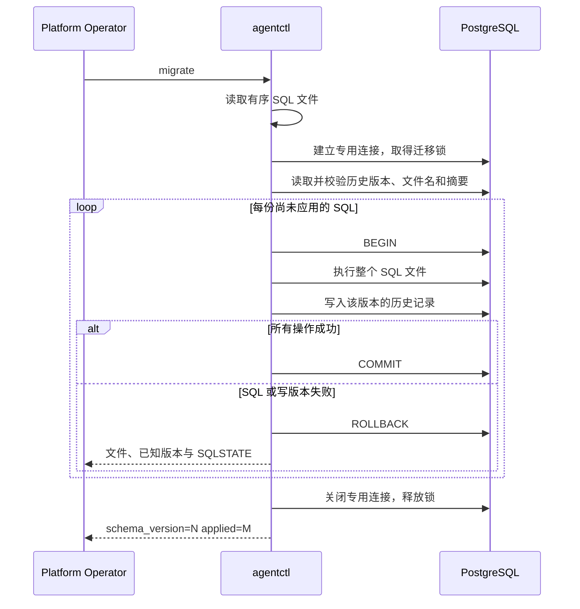

# T17：让数据库结构可以可靠地升级

T17 对应 GitHub [#23](https://github.com/TH1NKING/Build-your-own-Docker-with-Go/issues/23)。
它为后续 Conversation、Worker Credential 和 Execution 的持久化提供升级入口。
本次只建立 `control_plane` schema 和迁移历史，没有提前实现这些业务表。
具体参数与使用步骤见 [迁移合同](../agentctl-migrations.md)。

## 从一个具体问题开始

假设第一版已经有表，第二版要加列并回填数据。开发机运行一次 SQL 很容易，
但部署脚本可能执行两次，两位运维人员可能同时升级，SQL 也可能执行到一半失败。
我们需要回答：数据库现在是什么版本？哪些改动已经成功？下一次从哪里继续？

迁移是按版本排列的一组 SQL。每次成功后，数据库会保存该文件的版本、名称和摘要。
`agentctl migrate` 读取这些记录，只运行尚未完成的文件。
版本记录与数据库一起持久化，因此重启命令不需要记住上次进程运行到了哪一行。

图中的失败分支会终止整次运行，后面的迁移不会继续执行。

## SQL 与版本为什么必须一起提交

考虑第二份迁移先建表，再插入数据，最后一条 SQL 出错。
如果每条语句自动提交，就可能留下已经创建的表和一部分数据。
下次重跑既不知道哪些步骤完成了，也可能遇到表已存在或主键重复。

现在，整份 SQL 和它的版本记录位于同一个事务中。
失败时二者一起回滚；成功时二者一起提交，避免结构与版本记录各走一步。
每份文件单独提交，所以第 2 份失败时，第 1 份仍然保留。
这是 PostgreSQL 的 [事务原子性](https://www.postgresql.org/docs/17/tutorial-transactions.html)
在部署流程中的具体应用。

整个升级包也可以只开一个大事务，其优点是整个发布一起成功或失败。
本次按文件提交，适合从最后成功版本继续；代价是迁移作者必须让每个中间版本都有明确含义。
正在服务业务的系统还要设计新旧程序与中间 schema 的兼容性，不能只靠迁移事务解决。

## 版本号之外，为什么还保存摘要

如果数据库说已经执行了版本 1，但有人修改了版本 1 的 SQL，
只检查数字会把两份不同的数据库结构都叫作“版本 1”。
本次检查已应用文件的名称与 SHA-256；发现变化就拒绝继续。
修改空白或换行也会改变摘要，因此仓库为 SQL 固定 LF 换行。

正确的升级方式是追加新文件。尚未成功应用的失败文件可以修正后重试；
已经在某个安装中成功应用的文件必须保留，不能为了另一个安装的失败而直接改历史。
摘要用来检测迁移来源变化，并不证明当前数据库的每一张表都未被手工修改。

## 为什么使用数据库锁和专用连接

两个进程都读到版本 0，就可能同时决定执行版本 1。
普通 Go mutex 只能协调同一进程；两台机器上的两个命令不会共享它。
文件锁也依赖共同文件系统，数据库连接才是这些命令共同访问的边界。

本次使用 PostgreSQL session advisory lock，从初始化历史表之前一直持有到命令结束。
第二个命令等待第一个完成，然后重新读取历史，因此能看到已经提交的版本。
专用连接使锁和这次运维操作拥有相同寿命，关闭连接就释放锁。
如果用连接池而没有固定连接，取得锁与执行 SQL 可能落在不同会话，生命周期会更难管理。
会话锁跨越多份文件的事务；transaction advisory lock 会在每次提交时释放，覆盖范围不同。
参见 [PostgreSQL advisory lock](https://www.postgresql.org/docs/17/explicit-locking.html#ADVISORY-LOCKS)。

这是一种协作锁：其他手工 SQL 客户端不会自动遵守它，也不是业务读写暂停机制。
升级造成的表锁及业务影响仍需在 SQL review 中评估。

## 本次真实测试发现的超时问题

最初只把带期限的 Go context 交给驱动。测试运行了“插入一行，再等待很久”的 SQL。
命令确实报告超时，但下一次迁移还在等待锁：客户端结束等待，不代表服务端已停止执行。

修正后，context 取消会通过 pgx 的 `CancelRequestContextWatcherHandler`
主动请求 PostgreSQL 取消当前语句，再尝试回滚并关闭连接。
它有 2 秒网络回退期限；回滚和关闭各有独立的 5 秒清理期限。
清理不用已经取消的工作 context，否则可能连 ROLLBACK 都发不出去。
真实测试验证：超时迁移中的插入回滚，下一次运行能取得锁并完成同样的插入。
驱动的默认行为和取消机制见 [pgconn 文档](https://pkg.go.dev/github.com/jackc/pgx/v5/pgconn#hdr-Context_Support)。

这不等于网络故障下总能立即确认服务端状态。尤其在 COMMIT 已发送但确认丢失时，
服务端可能已经提交；此时错误只报告“最后确认的版本”，需要重连运行 `--status` 核实。
可靠的处理是保留不确定性，再读取数据库的持久记录。

## 几种实现方案的取舍

| 选择 | 本次得到的好处 | 代价或其他方案更适合的情况 |
| --- | --- | --- |
| 显式、有版本的 SQL | 能 review DDL、回填次序与事务边界 | 需要维护迁移文件；ORM 自动迁移适合更简单的结构同步，但复杂数据变更仍需显式设计 |
| 每文件一个事务 | 保留已完成进度，失败文件整体回滚 | 中间版本需要可用；要求整个发布原子性时可选择一个大事务 |
| 默认内嵌 SQL | 发布二进制与 SQL 一起交付，避免漏文件 | 更新 SQL 要重新构建；可信目录选项用于独立验证完整迁移序列 |
| pgx 加专用 runner | 事务、版本与锁逻辑直接可读，依赖范围小 | 需自行维护；需要 down、非事务迁移、多数据库支持时，应重新评估成熟迁移库 |
| PostgreSQL 协作锁 | 能协调不同进程甚至不同机器 | 依赖数据库会话；不约束绕过工具的手工 DDL |
| 真实数据库和 CLI 测试 | 检查实际事务、权限、取消、锁与进程退出行为 | 需要隔离测试实例；mock 难以证明这些数据库语义 |

## 测试如何证明这些行为

入口是 `tests/agentctl_migration_test.go`，运行的是实际编译出的 `agentctl`。
每个数据库用例先用测试管理员创建独立 database 与非超级用户 owner，
迁移过程使用普通 owner，结束后只删除本用例创建的资源。

- 空库第一次输出 `schema_version=1 applied=1`，再次执行输出 `applied=0`。
- `--status` 使用 PostgreSQL 强制只读连接，在空库和升级后都能返回版本。
- 第 2 份迁移先做 DDL、DML，再除零；修正后重复相同建表和插入操作成功，证明它们均已回滚。
- 已应用文件被修改、改名或从来源中删去时，重跑拒绝继续。
- 两个真实进程同时迁移，只有一个应用文件，另一个等待后报告无需更新。
- 长 SQL 超时后可以重试；另一个进程等待迁移锁时也受期限限制。
- 错误连接串和数据库诊断只暴露必要信息，不输出连接密码或原始数据库消息。

锁等待测试通过自己创建的测试表制造阻塞，再观察 PostgreSQL 的活动查询确认时机。
查询活动在事务中可能使用缓存快照，测试显式刷新快照，避免靠固定 sleep 猜测进度。
这也曾使最初的测试误判为命令没有到达阻塞点。
参见 [PostgreSQL 统计快照](https://www.postgresql.org/docs/17/monitoring-stats.html)。

## 建议的代码阅读顺序

1. `cmd/agentctl/main.go`：参数、环境变量、工作期限、退出码与输出。
2. `internal/migrations/sql/0001_control_plane.sql`：本次实际创建的 schema。
3. `internal/migrations/migrate.go` 的 `Run`：专用连接、锁、历史校验和顺序推进。
4. 同文件的 `apply`：SQL 与版本记录如何共用事务，以及失败清理。
5. `tests/agentctl_migration_test.go`：先看失败恢复与并发用例，再看超时验证。

面试时可以从“SQL 变更和版本记录必须同事务提交”讲起，
再用本次发现的“客户端超时，但数据库仍在持锁”的实际问题解释取消与恢复。
这样每个设计选择都有具体问题和可重复的测试支撑。
