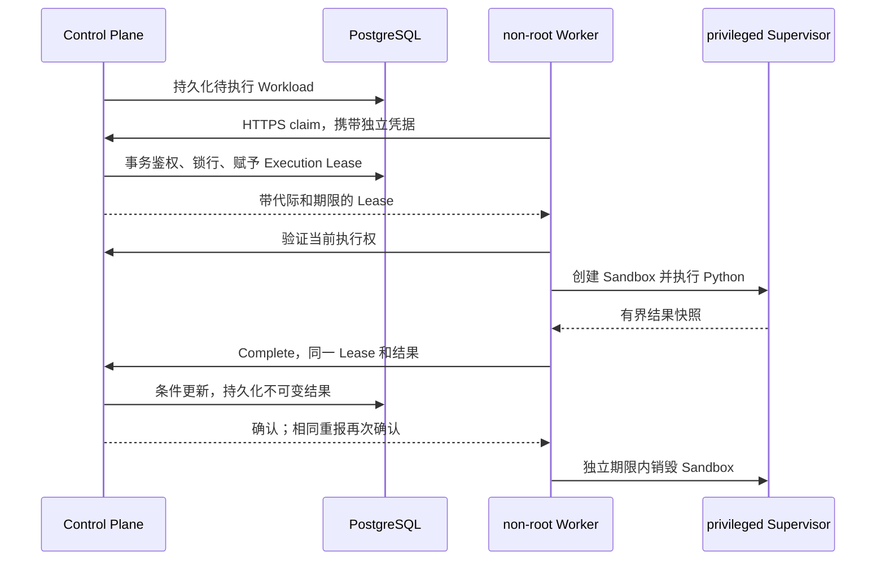

# T22–T24：从本地沙箱到持久执行链路

本文保留 T22–T24 完成时的设计与边界。后续 T27/T31 已增加容量控制与同 Worker 恢复，当前配置和故障语义请结合 [Worker API 合同](../worker-api-v1.md) 与 [T27/T31 学习笔记](t27-t31-worker-capacity-recovery.md) 阅读。

我已经能通过本地 Supervisor 运行 Python。这一阶段补上 Worker 身份、数据库领取和结果上报，让执行面通过受限协议使用已有沙箱能力。这里完成的是单次 Execution 链路，完整 Agent Loop、容量调度、断连恢复和生产部署仍有后续 ticket。

## 沿着一次执行看代码

1. `cmd/agentctl/worker.go` 与 `internal/workercredential`：凭据管理命令、摘要核验和 Linux 文件权限检查。
2. `internal/executionqueue/store.go`：可信入队、事务领取、只读状态；`results.go`：执行权检查和不可变结果提交。
3. `internal/workerapi`：受限 HTTPS 协议；`report_decode.go` 在解码过程中限制输出文件数量。
4. `cmd/control-plane`：数据库和迁移就绪后启动 TLS；`cmd/worker` 与 `internal/worker`：普通账户读取私有凭据，把 Lease 转成现有 Supervisor 请求。
5. `tests/worker_api_test.go`：真实数据库并发和失败语义；`tests/worker_execution_linux_test.go`：真实 Linux 上的完整执行。

命令、配置和协议见 [Worker API v1](../worker-api-v1.md)。

## 为什么每个 Worker 单独发凭据

我需要能单独撤销一台机器，而不影响其他 Worker。token 由密码学随机源产生，具有 256 位随机熵，数据库仅保存 SHA-256 校验值；原始 token 只在发放或轮换时返回。Linux 加载时检查已打开文件的所有者、类型和权限，避免先检查路径再打开时发生替换。

这里的 SHA-256 用于核验高熵随机凭据，不能照搬去保存人的低熵密码。摘要不是加密，无法恢复原 token。

共享 token 配置简单，但一台机器泄漏就需要全部轮换。JWT 可以减少某些数据库查询，即时撤销却需要额外状态或很短的有效期；领取本就需要数据库事务，直接核验摘要更容易实现撤销语义。mTLS 有更强的客户端证书绑定能力，也需要签发、分发和轮换流程，目前按 ADR-0024 留作后续选择。

## 为什么让数据库决定执行权

如果先 SELECT 再单独 UPDATE，两台 Worker 可能同时读到一条待执行记录。当前领取在一个事务内完成鉴权、锁行和租约写入，`FOR UPDATE SKIP LOCKED` 让其他领取者跳过正在占用的记录，提交成功后才返回 Lease。

Worker 身份行也被锁住，使领取与撤销/轮换具有明确先后。到期检查使用数据库时间，最终写入条件再次检查凭据和租约期限，避免处理大结果期间跨过到期点仍接受写入。

进程内 mutex 不能协调多个 Control Plane 或重启后的状态。Redis、RabbitMQ、Kafka 有更丰富的队列能力，也增加数据库与队列的一致性和运维问题。当前小规模执行队列使用 PostgreSQL 共享事务边界，符合 ADR-0023；这里尚无吞吐量基准，不能声称适合高并发调度。

凭据代际和执行租约代际是两件事：前者描述凭据轮换，后者描述某次 Execution 的执行权。结果必须来自当前 Worker 和当前 Execution 代际，不能只凭 execution_id 覆盖记录。当前首次领取产生代际 1，不自动改派或续租；失联后换代恢复尚未实现。

## 为什么重试提交，不重跑不确定的代码

Python 和数据库可能都已完成工作，但 HTTPS 确认在返回途中丢失。Worker 只知道没有收到确认，不能推断没有执行成功。

我保留同一结果快照，重复提交相同 Execution 和代际。Control Plane 对相同结果再次确认，对不同结果返回冲突；成功结果不会被覆盖。已完成记录的租约随后到期，仍可确认相同结果，但凭据必须有效。

重新运行 Python 可能重复文件修改等副作用；完全不重试报告又容易被短暂网络故障打断。当前方案提供结果提交幂等，没有证明 Workload 副作用“恰好一次”，也没有 Worker 本地持久日志。进程丢失后的恢复由 T31 处理。

## 为什么完整结果不用 jsonb

测试发现 Python stdout、stderr 和 stdin 可以包含 NUL，而 PostgreSQL `jsonb` 不接受 `\u0000`。直接存 jsonb 会让一次合法执行在结果入库时不断失败。

现在用 `bytea` 保存固定类型规范编码后的 JSON 字节，保留 NUL 和二进制文件。需要查询、锁定的状态、Worker、代际和期限仍是关系字段。这样牺牲了直接查询输出内部 JSON 的便利，但当前读取完整快照的合同更重要。

## 为什么限制字节数还不够

一个空 JSON 对象只有几个字节，解码后却可能占几十字节。仅限制 HTTP body，再一次性解码大量 `outputs` 元素，仍可能分配远超请求大小的内存。

解码器现在逐个读取输出文件，发现第 17 个元素就拒绝，不等待数组结束；同时限制报告并发、文件总大小和字段内容。测试故意让非法数组保持未结束，确认服务已拒绝它。

## 验证和面试表述

数据库验收使用真实 PostgreSQL：并发 Worker 只有一个取得执行权，错误 Worker/代际、过期和撤销凭据被拒绝；API 重建后相同结果重报成功，冲突内容不能覆盖；NUL 输入输出保持不变。

Linux 联合验收使用真实 QEMU 内核、cgroup v2、Supervisor、Profile Bundle 和 CPython。故障用例在数据库完成提交后主动断开 HTTPS 响应，随后比较重报结果；Workload 使用独占文件创建和随机输出帮助观察意外重执行。另有非 root Worker 命令行、私有 CA、私有凭据文件和声明二进制输出验证。验收入口保留独立日志，CI 上传对应 artifact。

Windows 上的数据库/HTTP 测试证明持久化和协议行为，Linux 权限、隔离和清理结论以真实 Linux 验收为依据。这些是功能和失败路径证据，不是性能压测或生产安全认证。

面试时我可以说：“我实现了按节点管理的 Worker 凭据，用 PostgreSQL 事务和带代际的租约协调执行权，并让非特权 Worker 对接自研 Linux 沙箱。通过并发领取、过期拒绝和提交后断连测试，验证执行权约束与结果提交幂等。”

边界也要明确：当前每个 Agent Run 只有一次 Execution，没有完整 Agent Loop、心跳恢复、跨 Worker 迁移或公网生产部署。不确定执行不会自动重跑，防止重复副作用。
