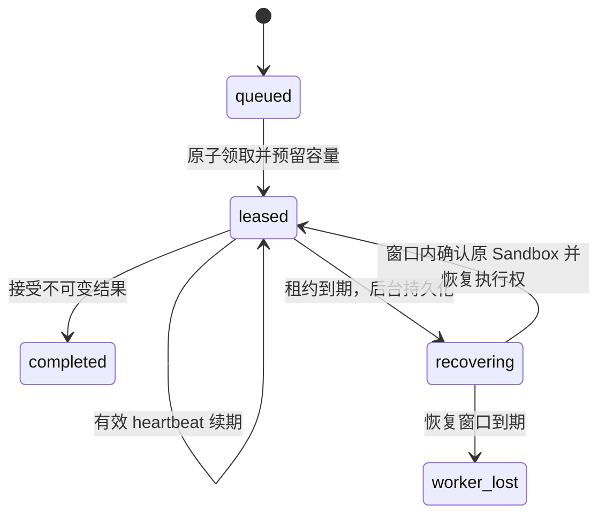

# T27–T31：Worker 容量与断连恢复

我已经有一条“领取 Execution、运行 Python、提交结果”的链路。这一阶段要回答两个进一步的问题：同一台 Worker 同时接到多个 Execution 时，怎样保证不会超过容量；Worker 和 Control Plane 暂时失去联系时，怎样保留原来的执行，又不把结果不明的代码重新运行一遍。

这里仍是每个 Agent Run 对应一次 Execution 的执行链路。完整 Agent Loop、多个 Execution 共享 Sandbox 的调度和 Operator Console 不属于这一阶段。T31 的恢复合同依据 [ADR-0010](../adr/0010-fail-runs-after-the-worker-recovery-window.md)，数据库队列的选择依据 [ADR-0023](../adr/0023-use-postgresql-as-state-store-and-execution-queue.md)。

## 我先区分三种不同的限制

| 限制 | 回答的问题 | 执行位置 |
| --- | --- | --- |
| 单个 Sandbox 的 Resource Budget | 一个 Sandbox 最多消耗多少 CPU、内存、进程和存储资源 | Supervisor、cgroup 和其他 Linux 机制 |
| Worker 的 Sandbox 容量 | 这台 Worker 同时承担多少份 Sandbox 责任 | Control Plane 的持久预留与 Worker 本地并发控制 |
| Execution Lease 与恢复窗口 | 这个 Worker 还能否执行和提交这次 Execution，以及失联后还能等待多久 | PostgreSQL 状态与 Worker 的本地生命周期控制 |

我把默认容量设为 2，并允许可信启动配置调整它。这个数字不是根据性能压测得出的最优值，只是让并发行为可演示、资源需求可控制的默认值。给每个 Sandbox 配置 cgroup 不能代替整台 Worker 的接纳控制；反过来，限制 Sandbox 数量也不能代替每个 Sandbox 自己的资源预算。

## 为什么容量预留必须和领取放在同一个事务里

假设容量是 2，当前已经占用 1 个名额，同时来了两个领取请求。如果两个请求都先读到“还剩 1 个”，随后各自分配一个 Execution，最终就会占用 3 个名额。

我在 `executionqueue.Store.Claim` 中复用 Worker 身份行的事务锁。持有这把行锁时，先读取配置容量和未释放的预留数量；有名额才领取一条 `queued` Execution，并在同一事务内记录 Worker、租约代际和期限。事务提交后才返回 Lease。同一 Worker 的其他领取者必须等到前一个事务结束，因此它们会看到前一次领取产生的占用。

Execution 行本身使用 `FOR UPDATE SKIP LOCKED`，用于避免不同领取者同时拿到同一条 Execution。这和 Worker 行锁解决的是两个不同问题：前者保护一条待执行记录，后者保护一台 Worker 的总容量。不能只加其中一把锁就认为两种约束都成立。

Worker 内也保留有界并发槽，避免在本机启动超过配置数量的执行流程。它能减少无效请求和本地并发，却不能单独承担容量合同：两个使用同一 Worker 身份的客户端不共享 Go channel；进程重启也会清空 channel。数据库中的预留能跨 API 实例和重启保留，适合作为最终判断依据。

这个做法会串行化同一 Worker 的领取事务。我接受这个取舍，因为事务很短，当前目标是少量 Worker 的可解释调度。是否需要更复杂的计数器、调度服务或独立消息队列，应由实际竞争和吞吐测量决定。

## Complete、清理和 Release 分别意味着什么

我把“执行完成”和“容量可复用”拆成不同事实：

1. `Complete` 表示不可变 Execution Result 已经被 Control Plane 接受。
2. `DestroySandbox` 表示 Supervisor 已处理 Sandbox 的终止、进程回收和本地清理。
3. `Release` 表示可信 Worker 已确认清理完成，Control Plane 可以释放该 Execution 的容量预留。

因此，`occupied` 统计的是尚未解除的预留责任，不是某一瞬间观察到的 Python 进程数。刚领取、尚未创建 Sandbox 的 Execution 要占名额；结果已经提交、Sandbox 尚未清理的 Execution 也要占名额。租约到期和 `worker_lost` 本身都不能证明本地资源已经消失。

如果 Supervisor 遇到陌生文件、目录身份发生变化或清理失败，我不能为了让队列继续运行就递归删除未知状态，也不能直接把名额归还。当前 Worker 会保留占用并停止继续接单，让失败处于可观察状态。修复问题后，只有确认本地清理成功，才可以提交容量释放。

`Release` 是受 Worker Credential 约束的可信执行面操作。Control Plane 没有远程读取 Worker 内核状态的能力；它依赖可信 Worker 按协议上报清理事实。Workload 无权通过这个接口自行增加容量或宣称清理成功。

## 我怎样定义一次可恢复的断连

恢复必须延续原来的执行身份：同一 Worker、同一 Execution、当前租约代际和已绑定的原 Sandbox。只看到 Worker 又发来了请求，并不足以说明之前的 Sandbox 还完整存在。

我先生成私有 Sandbox ID，通过 `BindSandbox` 持久绑定到当前 Lease，再发出本地创建请求。同一绑定可以重试，不同 Sandbox ID 不能覆盖已有绑定。把绑定放在创建前，是为了避免“Sandbox 已创建，但 Worker 在记录它之前退出”，导致 Control Plane 连需要确认清理的对象都不知道。

这也不意味着收到一次重试就可以再次执行 Python。创建、执行、结果提交和清理具有各自的失败语义。尤其是执行请求或响应不明时，不能通过新建 Sandbox、重发 `ExecutePython` 来猜测性恢复。

恢复的状态关系是：

容量释放不画成这张图中的 Execution 状态，因为它是另一项事实。`completed` 可以仍然占用名额；`worker_lost` 也可以等待清理确认。失联的 Execution 不会回到 `queued`。

## 心跳、恢复和扫描各自做什么

`Heartbeat` 对活跃 Execution 的租约续期，携带 Execution ID、代际和绑定的 Sandbox ID。身份来自鉴权结果，不能由请求中的任意 Worker ID 决定。这里的心跳首先证明这次 Execution 的执行面仍在续约，不应把它夸大为覆盖整台机器全部健康指标的监控系统。

租约已过期时，普通心跳不能直接越过恢复检查。Worker 需要通过 Supervisor 的 `InspectSandbox` 确认原 Sandbox 仍然活着，再调用 `Recover`。Control Plane 继续检查所有者、代际、绑定和恢复截止时间；通过后才重新给予有效执行权。

`SweepRecovery` 的职责是让超时变成数据库中的持久状态，而不是只在查询结果里临时显示一个“看起来已过期”的标签。没有新请求到来时，后台扫描仍应推进 `leased → recovering → worker_lost`；Control Plane 重启后也应依据已存期限继续处理。

一次失联的恢复截止时间由最后一次有效授权确定。失败请求、轮询、重复扫描和服务重启都不能把截止时间改成“现在再加一个窗口”，否则持续重试就能无限延长不确定状态。真正成功恢复后，Execution 回到正常租约生命周期，后续有效心跳可以继续续约；这和失败重试不断重置同一次失联窗口不同。

## 为什么使用数据库时钟，为什么恢复不增加代际

我让 PostgreSQL 的 `clock_timestamp()` 决定租约与恢复窗口是否到期，条件更新在真正写入时再次检查期限。Worker 机器时间和 Control Plane 机器时间可能不同，如果分别用各自墙上时钟裁决执行权，就可能对同一份 Lease 得出相反结论。

Worker 收到的授权包含服务端时间和期限。我把两者的时间差加到本地请求开始时刻，用单调计时 watchdog 控制最长恢复等待，避免响应传输时间延长授权。心跳成功后更新 watchdog，窗口耗尽则取消原执行上下文；不会把第一次 Lease 的固定期限永久绑在本地 RPC 上。每次 Execution 自身的 60 秒默认期限仍由 Supervisor 独立执行。数据库继续决定持久转换能否成功，本地等待不能让数据库接受已经过期的结果。

结果报告也有两种计时：健康连接下累计报告预算，断连期间由恢复 watchdog 限制。如果始终使用一个短报告总超时，就可能在允许恢复的窗口结束前先销毁 Sandbox。我用“结果已产生、报告被阻断”的独立场景验证这一点，并保留同一个结果快照。

报告请求可能比下一次心跳更早发现网络黑洞，所以报告链路自身遇到传输失败或超时时也会唤醒心跳检查，按最后确认健康的时间段计费。反过来，如果心跳一直成功、只有报告接口失败，报告预算仍会耗尽。心跳的半段 JSON 或响应体超时按传输故障重试；完整非法 JSON、错误身份和超限响应继续被拒绝。

心跳确认 `completed` 后停止续约，此后的结果确认等待全部计入报告预算。这样，即使结果已经提交、确认消息持续丢失，也不会因为心跳和 watchdog 都已停止而无限保留 Sandbox 与容量；持久结果仍然保留。

租约代际用来隔离不同执行授权的身份。当前恢复没有更换 Worker、Sandbox 或 Execution，也没有重新执行 Workload，所以我保留当前代际。网络请求重试次数不等于租约代际；每次心跳都增加代际，反而容易让同一原执行的结果报告与续期互相冲突。

保留代际不表示放松检查。错误 Worker、旧代际、错误 Sandbox ID、已释放预留和越过恢复窗口的请求都应被拒绝。以后如果真的引入所有权转移，必须重新设计代际推进和旧执行的隔离机制，不能直接套用当前同节点恢复流程。

## HTTPS 断开、Worker 退出和本地 RPC 丢失是不同故障

| 故障 | 我能保留的事实 | 处理原则 |
| --- | --- | --- |
| Worker 到 Control Plane 的 HTTPS 暂时失败 | Worker 进程和本地 Supervisor RPC 可能仍在运行，原 Sandbox 可以完整保留 | 在有界窗口内维持原执行，确认存活并恢复授权，不重发 Python |
| Complete 已提交，但 HTTPS ACK 丢失 | 数据库可能已有不可变结果，Worker 仍持有相同快照 | 重报同一结果；相同内容再次确认，冲突内容拒绝 |
| Worker 进程退出，导致执行中的本地 Unix socket 关闭 | Supervisor 能观察到原控制操作被放弃 | 按已有取消与清理合同处理；不能假设仍有可恢复的运行现场 |
| 本地 ExecutePython RPC 出错或响应不明 | Workload 可能已经产生副作用，结果也可能已被保留 | 不重发 ExecutePython；已保存结果和 Sandbox 是否存活分别检查 |
| 恢复窗口到期 | 无法再以原恢复授权继续这个 Execution | 持久化 `worker_lost`，不自动排队重跑，清理与容量释放仍需确认 |

Supervisor 的本地协议已经约定：拥有 Sandbox 的执行操作失去控制连接时，会取消其 Sandbox 并等待清理。T31 保留的是 HTTPS 网络短暂失联时仍存在的本地执行，不承诺 Worker 进程退出后的任意续跑，也没有跨 Worker 迁移、进程检查点或本地持久执行日志。

`GetExecutionResult` 返回保留快照，只能证明有结果可读。Supervisor 可以在 Init 已丢失后继续保留结果；`result_not_ready` 也只是一个结果槽的状态。因此，我新增独立的只读 `InspectSandbox`，检查原 Sandbox 对象、Init、生命周期状态、私有通道和原目录身份。

Inspection 不获取正在执行 Python 的互斥锁，不与 Init 争用执行通道，也不获得取消 Sandbox 的权限。这样运行中的 Sandbox 可以被检查，检查请求自身断开也不会杀掉原执行。它仍然只是检查时刻的存活证据，之后的进程丢失仍要由执行与清理路径处理。

## 我会按这个顺序读代码和做演示

1. [executionqueue/types.go](../../internal/executionqueue/types.go)：先认识 Lease、Capacity、Authority 和可观察状态。
2. [executionqueue/store.go](../../internal/executionqueue/store.go) 与 [capacity.go](../../internal/executionqueue/capacity.go)：跟踪事务领取、容量计数和释放，再看 [results.go](../../internal/executionqueue/results.go) 如何保护不可变结果。
3. [executionqueue/recovery.go](../../internal/executionqueue/recovery.go)：理解绑定、心跳、恢复和期限检查，再定位 `SweepRecovery` 的持久状态转换。
4. [internal/workerapi](../../internal/workerapi/)：对照请求字段、鉴权、严格解码和冲突返回，确认外部协议没有绕过数据库约束。
5. [internal/worker](../../internal/worker/)：沿 `Run`、`RunOnce` 和清理路径查看本地槽、执行上下文、结果重报与停止接单的关系。
6. [sandboxsupervisor/inspection_linux.go](../../internal/sandboxsupervisor/inspection_linux.go) 与 [lifecycle_linux.go](../../internal/sandboxsupervisor/lifecycle_linux.go)：理解存活检查和本地连接丢失的区别。

最小容量演示提交三个 Execution，配置容量为 2。前两个分别运行到结果提交边界，第三个保持排队；允许其中一个提交并清理后，第三个才能取得名额。对应 [worker_capacity_linux_test.go](../../tests/worker_capacity_linux_test.go)。

清理故障演示把容量设为 1，在真实 Python 完成后，由测试在可信运行目录中放入自己创建的陌生文件。Supervisor 拒绝删除不属于清理合同的内容，Worker 返回错误并停止接单。此时结果已经完成，容量仍是占用 1、可用 0。移除测试自己创建的障碍、确认销毁并释放后，可用容量才恢复。对应 [worker_cleanup_capacity_linux_test.go](../../tests/worker_cleanup_capacity_linux_test.go)。

断连演示让原 Sandbox 中的 Workload 创建一次性标记，再临时阻断 Worker API，观察数据库进入 `recovering`，检查原 Sandbox ID 仍然存活，恢复连接后等待原结果提交。还要单独延长断连超过窗口，确认得到 `worker_lost`、没有第二次领取或执行。一次成功恢复不能替代这个终止分支的验收。

## 验证状态与我能据此得出的结论

当前已经核实真实 PostgreSQL 的容量 API 验收通过；真实 Linux 上，“两个 Sandbox 独立推进、第三个等待释放”演示也已经通过。`InspectSandbox` 的真实 Linux 验收覆盖原 Sandbox 销毁后拒绝恢复检查、执行中检查不取消 Workload，以及 Init 丢失后不能凭保留结果宣称 Sandbox 存活。

Linux 6.12.107、Go 1.26.1、PostgreSQL 17.11 上的 Worker 联合验收覆盖 13 个顶层用例，另含执行中断连、等待报告和网络黑洞三个恢复子场景。覆盖两并发一等待、清理失败保留占用、原 Sandbox 恢复、窗口耗尽清理、报告独立失败、提交后持续丢失确认、显式新 Run、存活检查，以及已有的私有 CA、非 root Worker、ACK 丢失和二进制结果。

数据库与 HTTP 验收证明持久状态和协议约束；Linux 上的 Supervisor、进程与 cgroup 验收才支持本地生命周期和资源清理结论。上述结果属于功能与故障路径验证，没有提供吞吐量、恢复时延分位数或生产规模可靠性结论。

旧版本升级另有一个无法靠猜测修复的边界：历史记录没有 Sandbox ID，空值不能证明没创建过。我保守保留 `cleanup_unknown` 占用，让普通 Worker 拒绝自动释放。Platform Operator 先撤销旧凭据、停止并核实旧资源清理，再用受信命令 `agentctl worker confirm-legacy-cleanup --id ID` 确认；该命令本身不远程清理资源。完整顺序见 [Worker API 升级合同](../worker-api-v1.md#从旧执行协议升级)。

复现入口是 `make test-worker-api` 与 `make test-worker-execution`，两者要求专用 `AGENT_TEST_DATABASE_URL`；后者还需要 Linux、Profile 源码缓存、Supervisor 权限和 cgroup v2。`make check` 检查格式、静态分析、普通测试、构建和 Shell 语法。原 Sandbox 资源与安全回归通过 `make test-sandbox-acceptance` 执行。

## 面试时我怎样解释取舍

解释本地并发和持久约束时，我会区分两者的作用范围：带缓冲 channel 解决当前进程的并发上限，数据库事务解决同一 Worker 身份在多个请求、客户端和重启之间的容量约束。我同时使用两者，并明确数据库是最终判断依据。

解释结果完成后仍占用名额时，我会沿着实际清理路径说明：结果提交不能证明 namespace、进程、cgroup 和运行目录都已清理。提前释放会让调度认为资源可用，而本地仍承担旧 Sandbox 的责任。

解释放弃自动重排队的原因时，我会从副作用的不确定性开始。连接断开不能证明 Workload 没有执行，自动重跑可能重复副作用。我用原 Worker、原 Sandbox 的有界恢复换取短暂故障下的连续性，超过窗口后明确失败，由 Platform Operator 显式决定是否创建新的 Agent Run。

讨论 Redis 或消息队列时，我会说明它们与这个问题的关系：更换队列不能自动回答 Sandbox 是否还活着、旧执行是否可能产生副作用、谁有权提交结果。当前 PostgreSQL 能把持久状态和领取约束放在一个事务边界内；额外队列值得引入时，也仍需要保留这些生命周期合同。

我可以把这一阶段概括为：为已有 Linux Sandbox 执行链路增加持久容量预留和同节点有界恢复，把结果完成、资源清理与容量释放分别确认，并通过故障注入验证不确定执行不会自动重跑。它不等价于对任意 Workload 副作用提供 exactly-once 保证。
